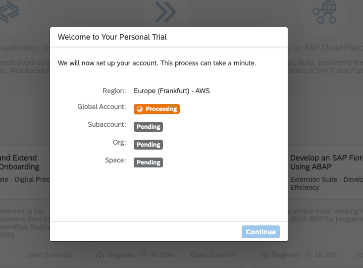
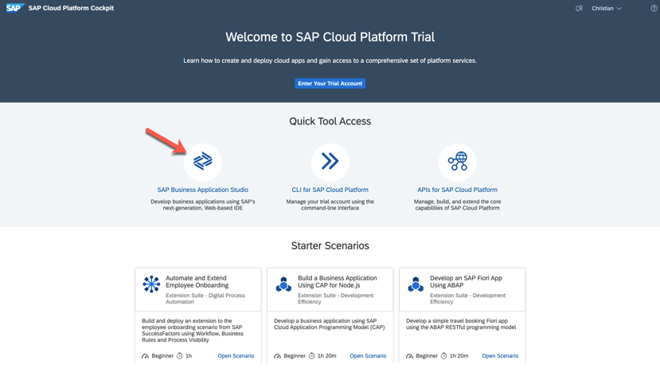
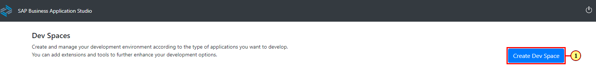
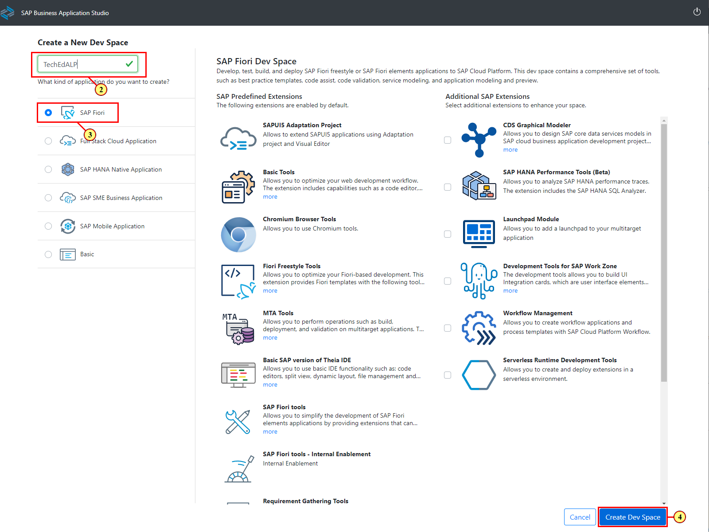
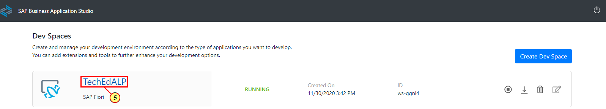
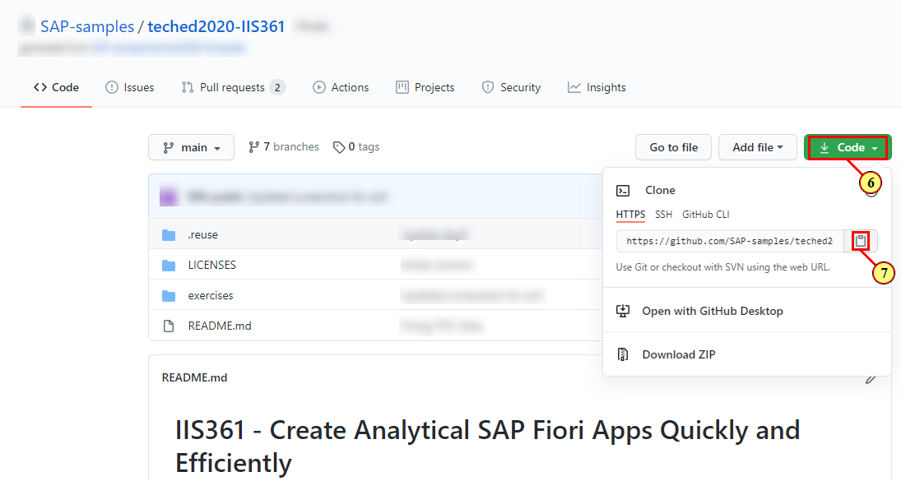
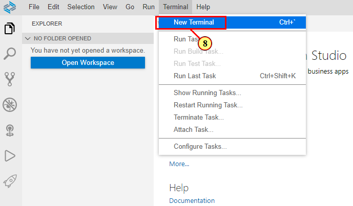
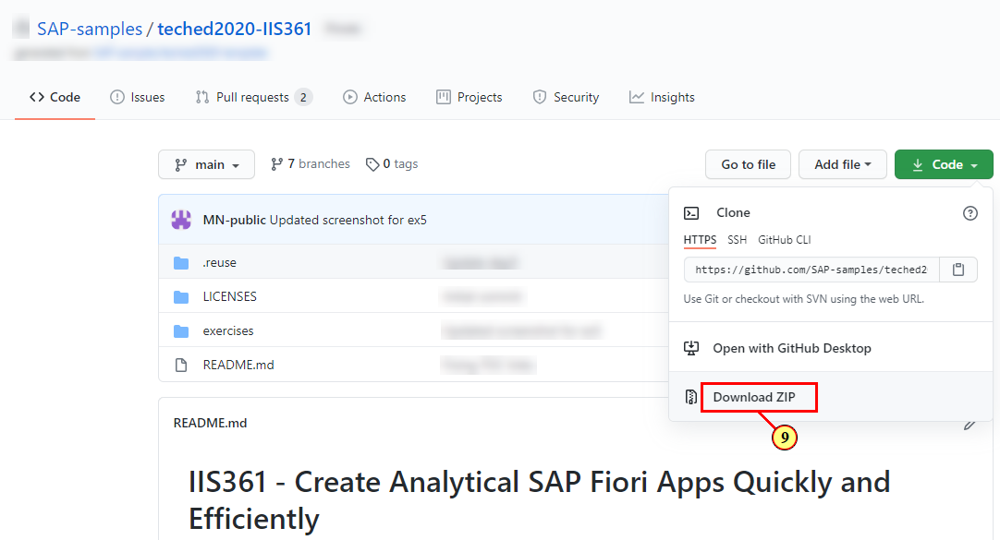
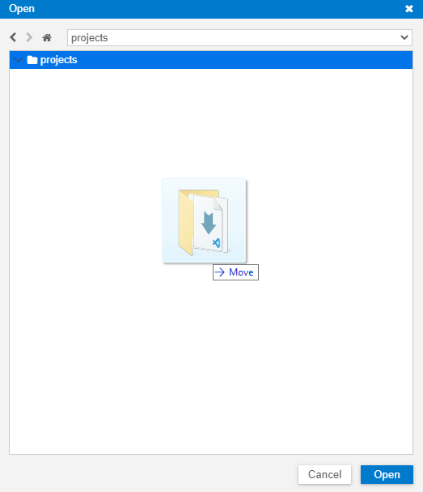

**Getting Started - Setting up your development environment**
============================================

Welcome to the workshop **Create Analytical SAP Fiori Apps Quickly and
Efficiently**.

This workshop will guide you step-by-step through the process of
creating a Fiori elements floorplans for OData V2. You will be using a
local OData service equipped with basic UI annotations. You will learn
how to generate and enhance an Analytical List Page Fiori elements
application with the help of Fiori Tools. 

Access SAP Business Application Studio (TechEd 2020 live workshop registered participants only)
---------------------------------------------------------------------------------

Log on the SAP Business Application Studio via [this
link](https://sap-ux-teched.cry10cf.int.applicationstudio.cloud.sap/index.html)
by using the provided live workshop credentials

You can continue with step Create Dev Space.

Set up Business Application Studio in an SAP Cloud Platform Trial Account
-------------------------------------------------------------------------

If you do not have an SAP Cloud Platform account already, you can create
it [here](https://www.sap.com/products/cloud-platform/get-started.html).

### New Trial Users

After having registered your new user, start your trial via [this
link](https://account.hanatrial.ondemand.com/register). At first time
log in, you will be asked to select your preferred region.

This will start the set up of your account.

Your subaccount, org and space is created automatically, along with the
necessary role configurations and subscriptions. When done, the
subaccount overview page is shown.

### Existing Trial Users

In your subaccount,

-   Choose **Subscriptions** in the left-hand navigation

-   Choose **SAP Business Application Studio** in the list of available
    subscriptions

-   Choose **Subscribe**

Navigate back to your subaccount overview page.

### Access SAP Business Application Studio

Click this tool icon to access the SAP Business Application Studio.

Create Dev Space
----------------

(1) Click **Create Dev Space** button to add a new dev space.

(2) Enter a name for your dev space.

(3) Select profile **SAP Fiori**.

(4) Click **Create Dev Space**.

(5) Once your dev space has status **running**, click on the dev space
name to access it.

 Get the sample scenario
------------------------

Access the Github Repository via [this
link](https://github.com/SAP-samples/teched2020-IIS361).

(6) Click on the code button .

(7) Click copy  icon . The GitHub link is copied.

(8) In SAP Business Application Studio, open a new terminal by choosing
**Terminal**-\>**New Terminal**. In the terminal window, make sure you
are in **projects** folder run the command git clone with the GitHub
link you copied: git clone
https://github.com/SAP-samples/teched2020-IIS361.git

**Note**: (9) As an alternative to cloning, you can choose **Download
ZIP** in the Github repository.

Then in SAP Buslienss Application Studio, choose **File-\>Open** and
drag the unpacked project to the folder **home-\>user-\>projects**. Once
the project upload is finished, choose **Open**.

Summary
-------

You have the environment setup for development of Fiori applications. Continue to the [Exercise 1 - Generating a Fiori elements app](../ex1/README.md)
