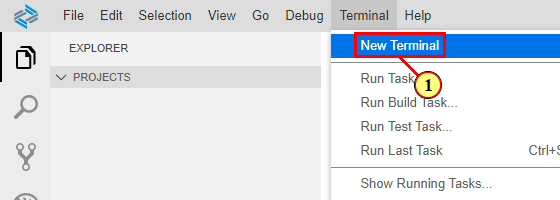

# Getting Started - Setting up your development environment

Welcome to the workshop 'Create Analytical SAP Fiori Apps Quickly and Efficiently'

This workshop will guide you step-by-step through the process of creating a Fiori elements floorplans for OData V2. You will be using a local OData service equipped with basic UI annotations. You will learn how to generate and enhance an Analytical List Page Fiori elements application with the help of Fiori Tools

## Access SAP Business Application Studio (TechEd 2020 live workshop registered participants only)

Log on the SAP Business Application Studio via [this link](https://sap-ux-teched.cry10cf.int.applicationstudio.cloud.sap/index.html) by using the provided live workshop credentials

You can continue with step 'Create Dev Space'

## Set up Business Application Studio in an SAP Cloud Platform Trial Account

If you don't have an SAP Cloud Platform account already, you can create your own [here](https://www.sap.com/products/cloud-platform/get-started.html)

### New Trial Users

After having registered your new user, start your trial via [this link](https://account.hanatrial.ondemand.com/register). At first time log in, you'll be asked to select your preferred region

This will start the set up of your account

Your subaccount, org and space is created automatically, along with the necessary role configurations and subscriptions. When done, the subaccount overview page is shown

### Existing Trial Users

In your subaccount, 

- Choose 'Subscriptions' in the left-hand navigation

- Choose 'SAP Business Application Studio' in the list of available subscriptions

- Choose 'Subscribe'

Navigate back to your subaccount overview page.

### Access SAP Business Application Studio

Click this tool icon to access the SAP Business Application Studiot

## Create Dev Space

1. Click here to create your dev space

2. Enter a name for your dev space and select profile 'SAP Fiori'

3. In the lower right corner press button 'Create Dev Space'

4. Once your dev space has status running, click on the dev space name to access it

## Get the sample scenario

1. Access the Github Repository via [this link](https://github.com/SAP-samples/teched2020-IIS361)

2. Click button code, then click here (1) to copy the git clone link

3. Open a new terminal via the header menu as shown in the below screenshot & click on higlighetd point (1)

4. In the terminal window, type the following commands and confirm with return:

    4a. Under the projects folder
    
    4b. git clone https://github.com/SAP-samples/teched2020-IIS361.git
## Summary
You have the environment setup for development of Fiori applications. To continue the exercise please go to [Setting up Fiori element project](../ex1/README.md)
