# Setting up Fiori element project
Now you will create a new SAP Fiori elements project in SAP Business Application Studio. For this exercise, you will not connect to a real backend system. Instead, you will use local files to simulate a backend server (mock server).

## Steps for the project creation

### Project creation using Template
Click on File ->  ‘New Project from Template’
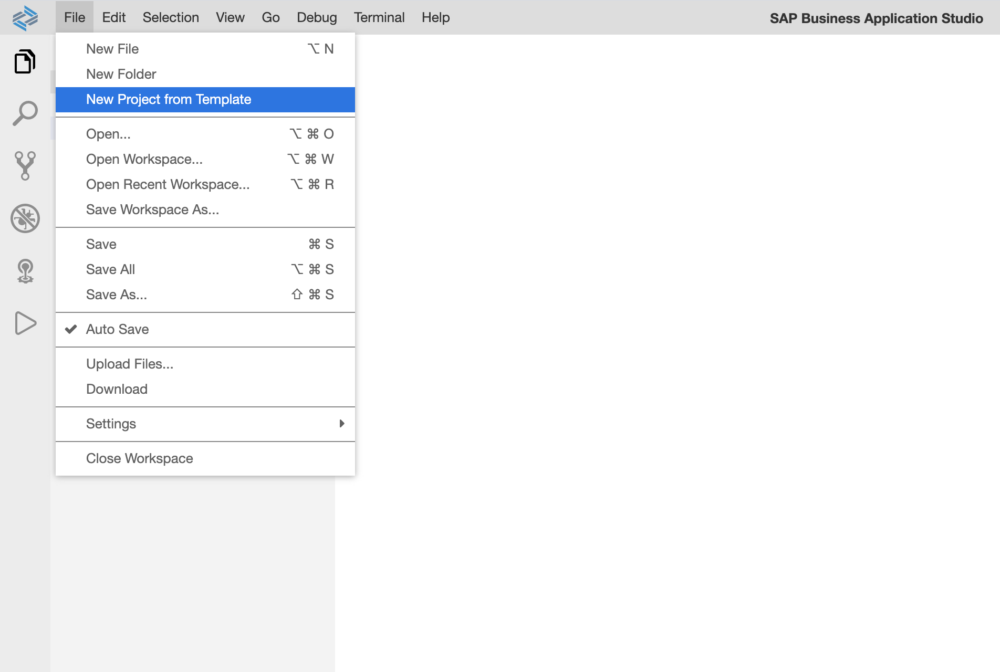

### Template and Application Type Selection
1. Select the template 'SAP Fiori elements application'
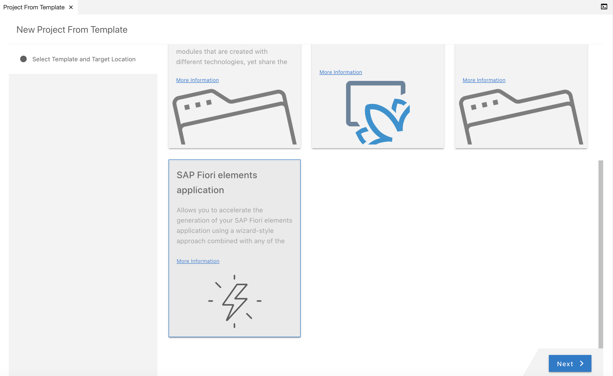

2. Click 'Next'

3. Select the application type 'Analytical List Page'

4. Click 'Next'
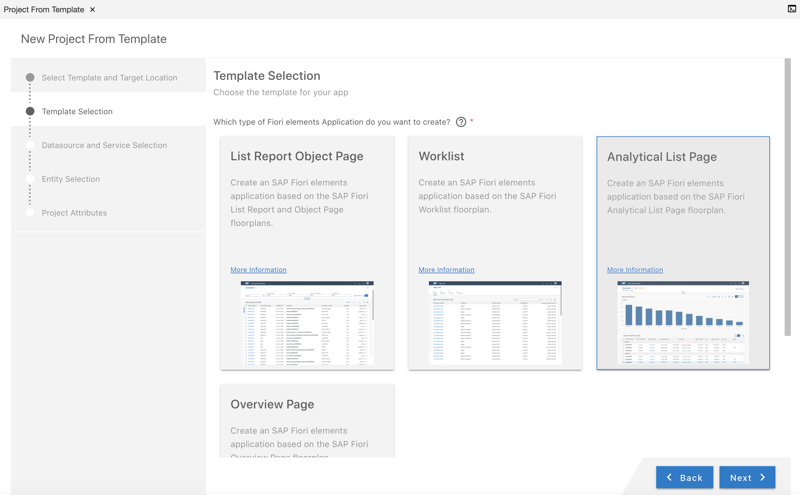

### Select the datasource and Service.
1. Select Datasource 'Upload a Metadata Document'
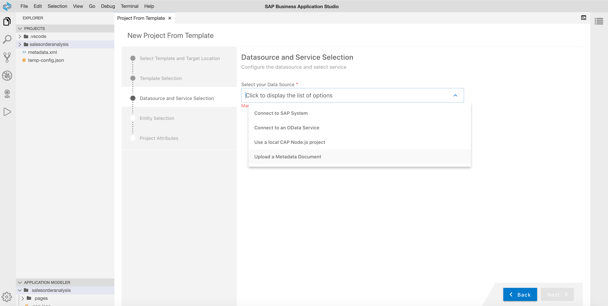

2. Enter the 'local metadata file path' as '/home/user/projects/teched2020-IIS361/exercises/ex1/resources/metadata.xml'
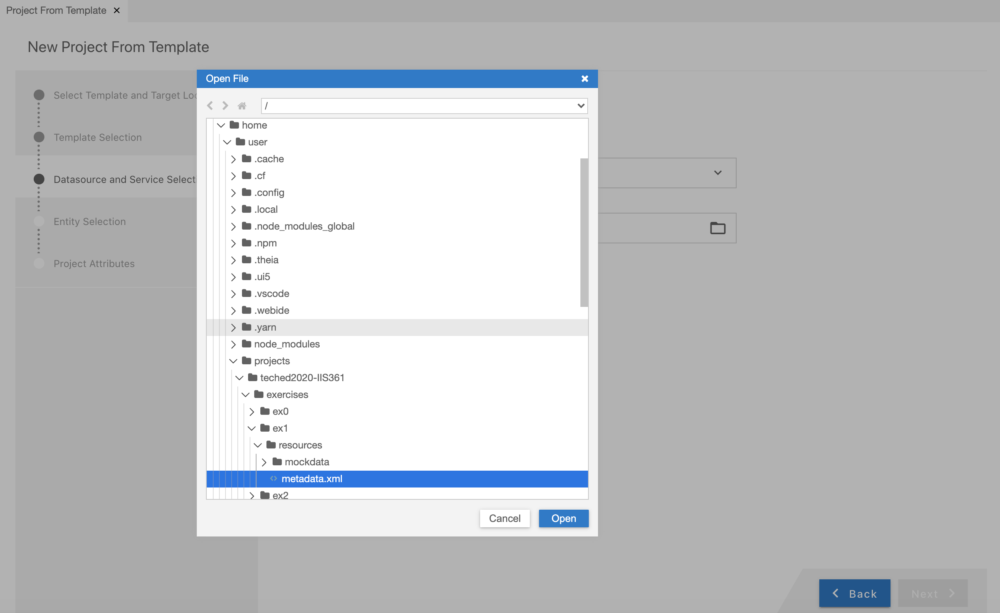

3. Click 'Next'
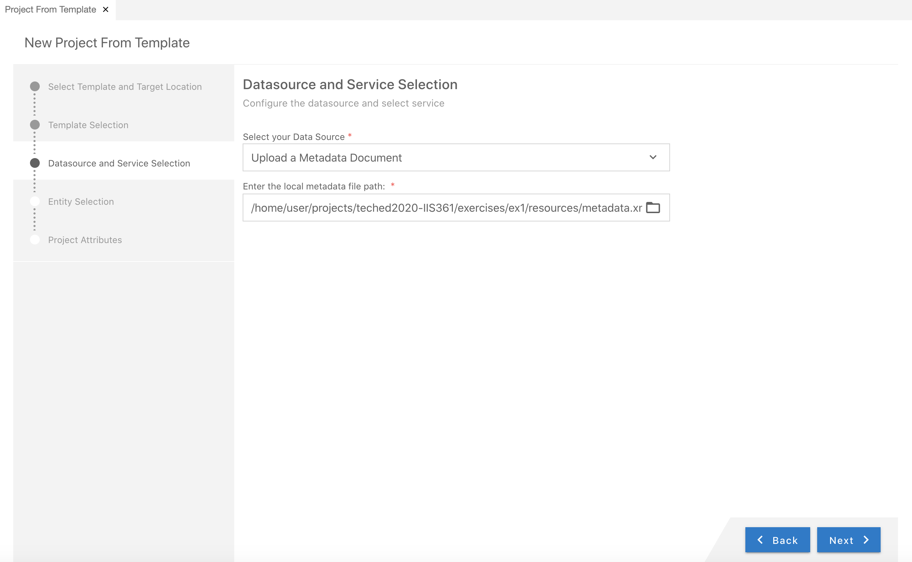

### Entity Selection 
1. Select the Entity as ‘Z_SEPMRA_SO_SALESORDERANALYSIS’
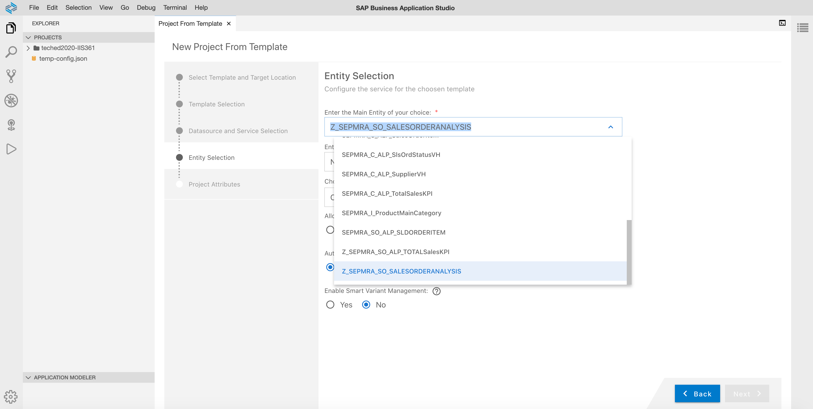

2. Enter the navigation entity of your choice as 'None'

3. Choose Table Type: as 'None'

4. Other options can be left with the default selection
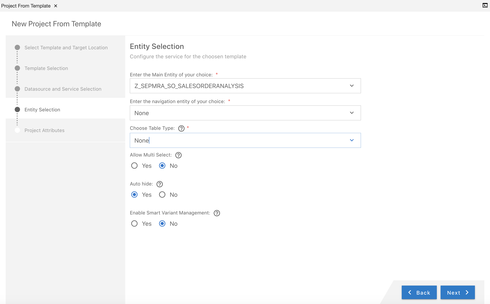

5. Click 'Next'

### Project Attributes
1. Enter the Name for your application 'salesorderanalysis'

2. Enter the Title for your application 'SalesOrderAnalysis'

3. Enter the Namespace for your application 'soa'

4. Other options can be left with the default values/selection

5. Click 'Finish'
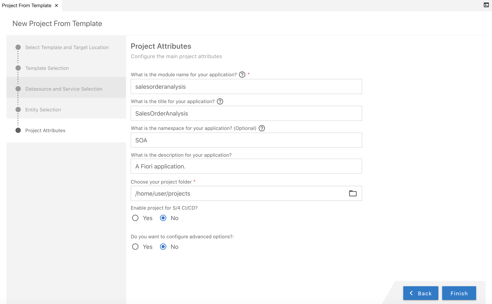

### Project Generation and addtion to project explorer
You will get a message 'Generating..'
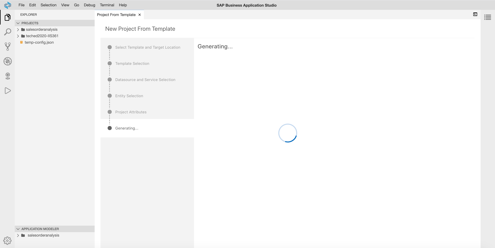

A project will be created and will be added to the project explorer
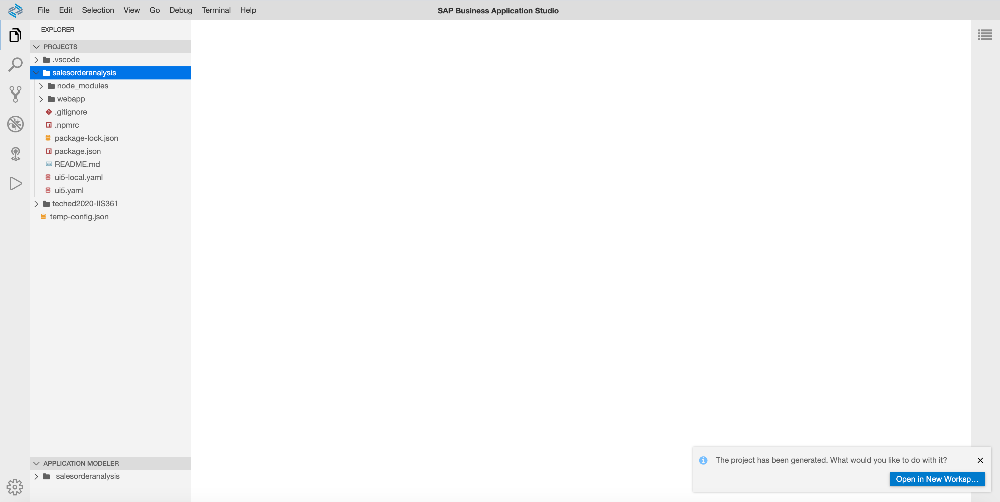

## Summary
You have successfuly created a Fiori elements Analytical List Page application. To continue the exercise please go to (Configuration of Content for Analytical List Page)[../ex2/README.md]