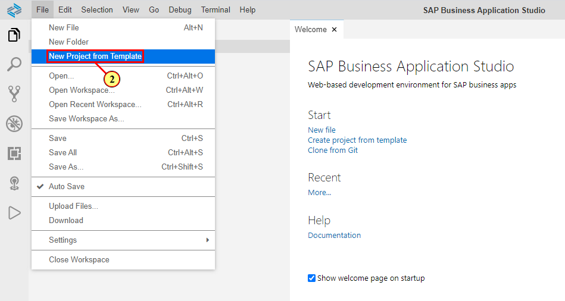
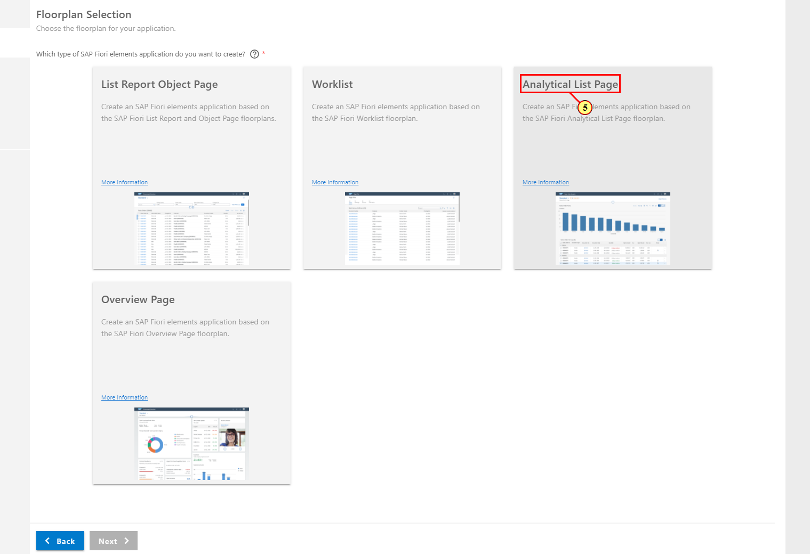
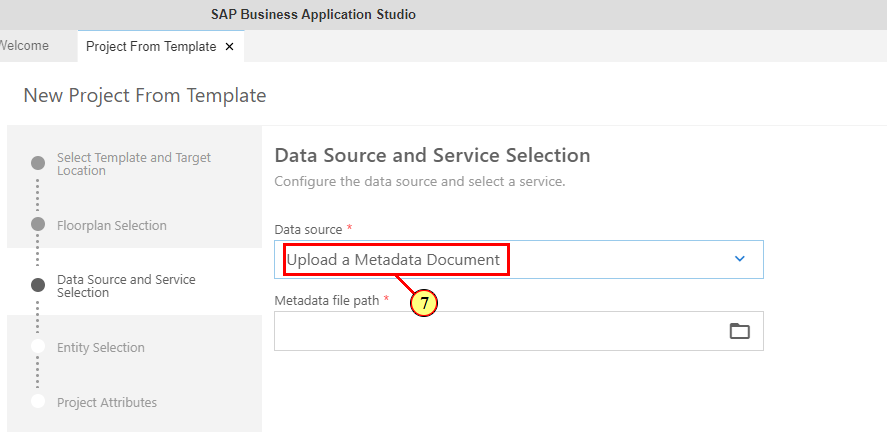
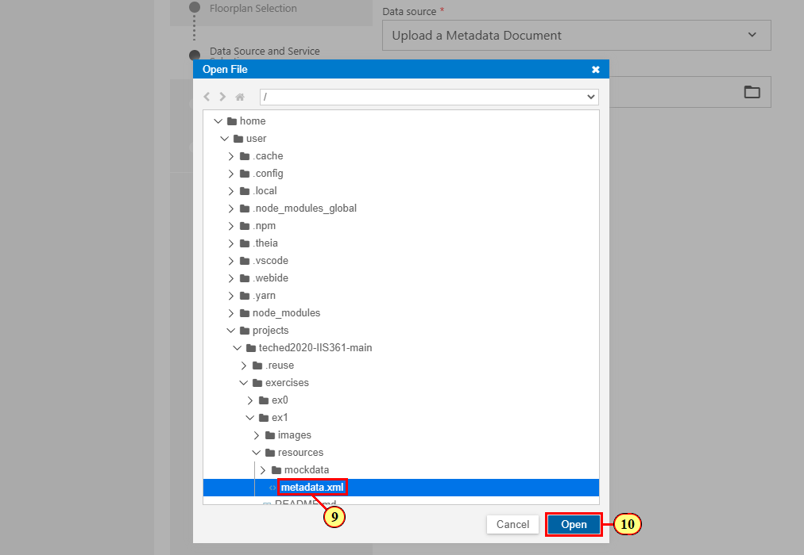
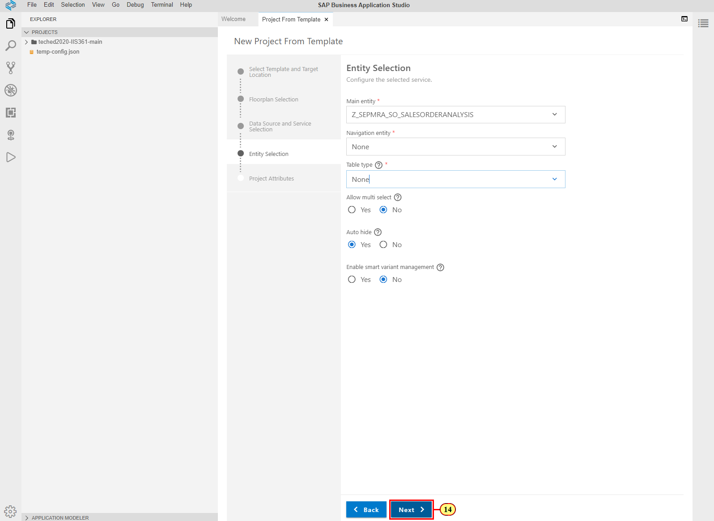
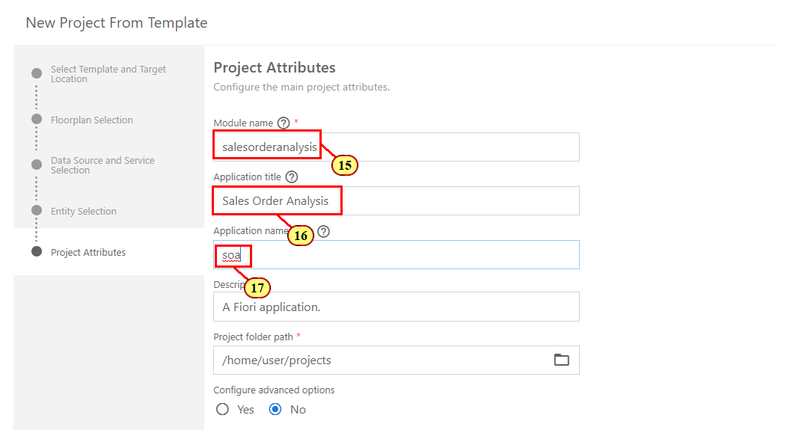
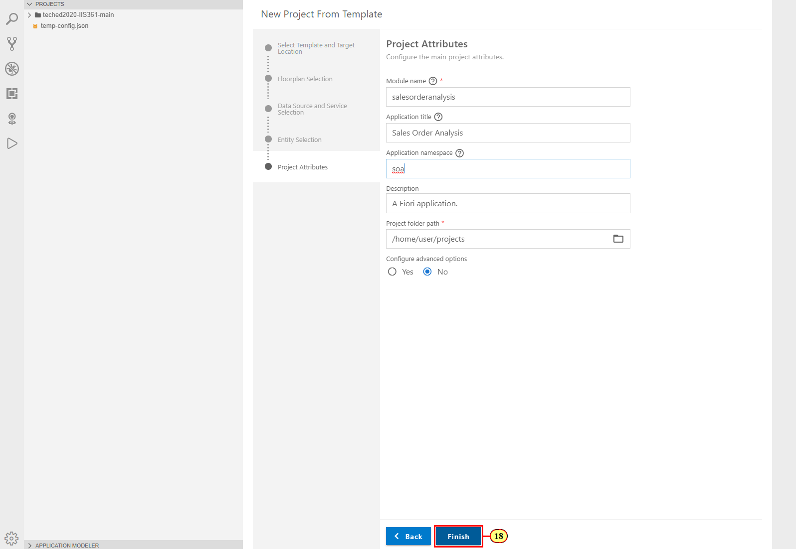
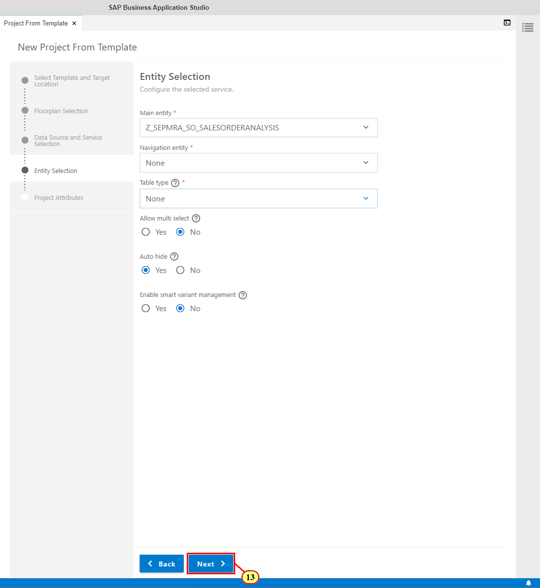
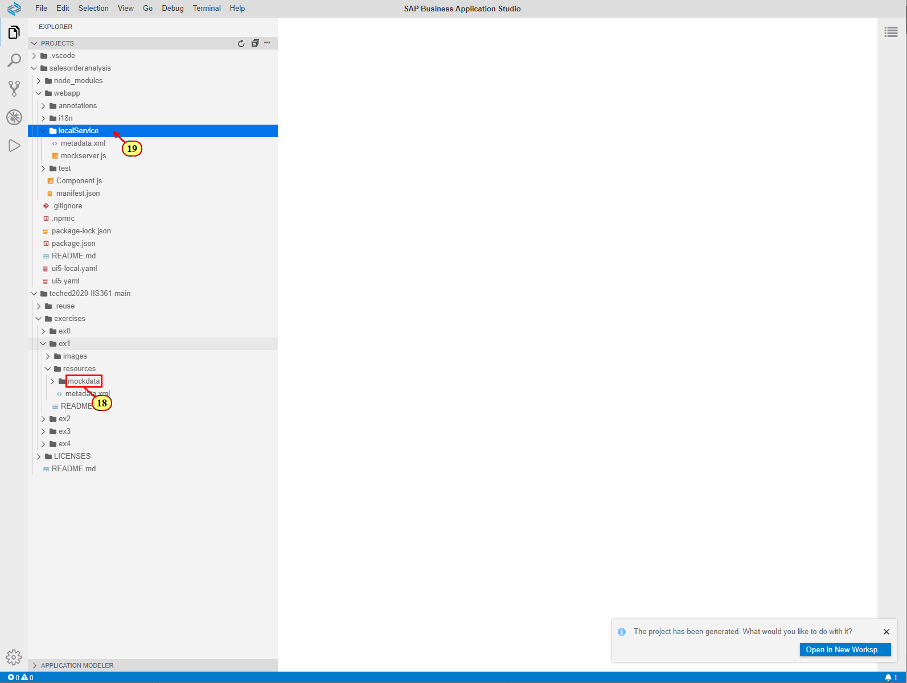

# Generate application 

(1) Click **File**  

(2) Click **New Project from Template** .

(3) Click on tile **SAP Fiori elements application**

(4) Click **Next** .

(5) In the template selection, click on tile **Analytical List Page**

 

(6) Click **Next**.

(7) In step **Datasource and Service Selection**, select **Upload a Mettadata Document**

(8) Click the **Browse for folder** icon  to
select the local metadata file.

(9) Open the folder hierarchy path
**home-\>user-\>projects-\>teched2020-IIS361-\>exercises-\>ex1-\>resources**
and select metadata.xml.

(10) Click **Open **.

(11) Click **Next **.

(12) In the Entity Selection drop down, select  as
a main entity.

(13) Select **None**  as a table type to accept the
default one.

(14) Click **Next** .

(15) Enter as module name **salesorderanalysis**

(16) Choose an App Title, for example **Sales Order Analysis**

(17) Choose a namespace, for example **soa**

(18) Click **Finish** .

