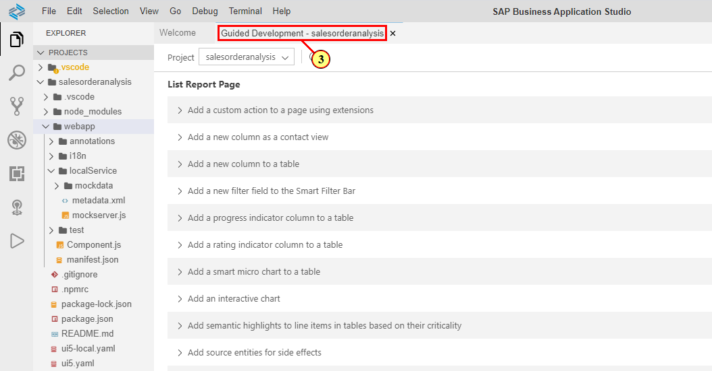
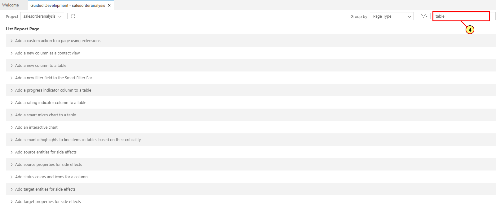
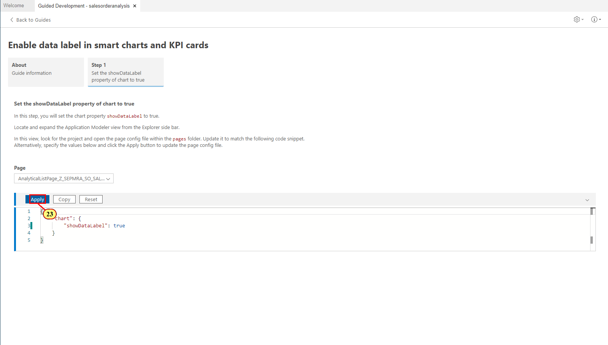

Exercise 2 - Configuring Content Area of Analytical List Page
==============================================================

In this exercise, you will define the content area of the Analytical List Page with Fiori Guided Development. For this, you first have to open the Guided Development tool.

(1) In the **Explorer** pane, right-click on the **webapp**  folder.

(2) Choose **SAP Fiori tools - Open Guided Development** .

(3) (Optional) Double-click on the **Guided Development -
salesorderanalysis** tab to get more editing space by temporarily hiding the **Explorer** pane.

Exercise 2.1 Configuring Table
------------------------------

In this exercise, you will configure the columns displayed in the table of the Analytical List Page. UI annotation 'LineItem' is used to represent the table, with DataField records representing the columns. As you will use the Guided Development tool, you do not need to add this annotation manually, just follow the steps below to configure the table and the respective annotation will be added to or updated in the local annotation file when you choose apply.

(4) To find the guides related to tables, type **table** in the search
field

(5) Scroll to the Analytical List Page group and expand the guide  **Add a new column to a table** .

(6) Read the description and click **Start Guide**.

This simple guide contains just one step adding a column (DataField record) to your table (LineItem). You can repeat this step as many times as needed to add all the columns to the table. If the table (LineItem) is not yet defined in your app, it will be created along with the first column.

(7) In the **Entity Type** field, choose your main entity type **Z_SEPMRA_SO_SALESORDERANALYSIS**.

(8) In the **Property** field, choose **Delivery Calendar Year** as your first column content. The code snippet is adjusted accordingly.

(9) Click **Apply**. Annotation UI.LineItem is added to your local annotation file as configured in the code snippet. This file gets open next to the Guided Development tool.

**Note**: If your selected entity type was already annotated with a UI.LineItem, the configured DataField record (column) would be added to it and a new UI.LineItem would not be created.

Now repeat steps **(8)** and **(9)** to add the records (columns) for the following properties:

-   DeliveryCalendarMonth

-   SalesOrder

-   SalesOrderItem

-   Product

-   MainProductCategory

-   SoldToParty

-   Quantity

-   NetAmount

(11) When the records for all property are added to your LineItem, click **Exit Guide** to get back to the list of available guides.

Exercise 2.2 Configuring Interactive Chart 
------------------------------------------

In this exercise, you will configure the chart to be displayed in the Analytical List Page. Annotation Term \"UI.Chart\" is used to visualize the data in the chart format. As you will use the Guided Development tool, you do not need to add this annotation manually, just follow the steps below to configure the chart and the respective annotation will be added to or updated in the local annotation file when you choose apply.

(11) Filter guides by **chart** in the search field.
 
(12)  Expand the guide**Add an interactive chart**  in the **Analytical List Page** group. 

(13) Click **Start Guide** .

(14) Enter the following values:

 | **Field**             |**Value**
 | --------------------- |----------------------------------
 | Entity Type           |SEPMRA_SO_SALESORDERANALYSISType
 | Chart Title           |Revenue by Customer
 | Chart Description     |Net Revenue by Customer
 | ChartType             |Column
 | Measure property      |NetAmount
 | Dimensions Property   |SoldToParty
 | Dimensions Property   |DeliveryCalendarYear
 
 
 
 

(15) Click **Apply**. UI.Chart annotation is added to your local
annotation file as configured in the code snippet.

Exercise 2.3 Configuring Presentation Variant
------------------------------------------------------------
In this exercise, you will configure a UI.PresentationVariant annotation that is used to display the main content of the Analytical List Page. Here you will assign the chart and table created earlier in this exercise as visualization artifacts and define the sorting order. To do so, you will use the step 2 of the Add interactive chart guide.

(16) Click **Step 2: Configure a UI.PresentationVariant annotation term**.

(17) Enter the following values:

  |**Field**                 |**Value**
  |------------------------- |----------------------------------
  |Entity Type               |SEPMRA_SO_SALESORDERANALYSISType
  |Sort Order Property       |NetAmount
  |Sort Order Descending?    |true
  |Include Grand Total?      |false
  |Initial Expansion Level   |1

(18) Click **Apply**. UI.PresentationVariant annotation is added to your local annotation file as configured in the code snippet.

(19) The content area for the Analytical List Page is configured. Click **Exit Guide**.

Exercise 2.4 Starting the Application Preview
------------------------------------------

In this exercise, you will start the preview of the Analytical List Page and view the content you just configured. 

Before you perform the steps below, make sure that the pop-ups from the SAP Business Application Studio are allowed in your browser.

(20) To show the hidden **Explorer pane**, double-click on the **Guided Development** tab.

(21) In the Explorer pane, right-click on the webapp folder.

(22) In the context menu, click **Preview Application**.

(23) Click **Yes** to allow exposing the port 8080. This is required to show the preview.

(24) Click **Yes** again to allow exposing the second port. Application preview will open in the next tab.

(25) in the **Adapt Filters** pop-up, enter **EUR** in the **Currency** field.

(26) Click **Go.**

The content area of the page shows the chart and table you created. The data is pre-filtered by the currency value you entered in the pop-up with the required filter field.

The filter bar area is empty as at this point no visual filters are defined. You will specify them in the next exercise.

You can click the button **Compact Filter**  to view the compact filter bar with the only required field available by default. You will add more filter fields in the next exercise.

Summary
-------

You have successfuly annotated the main entity type of your app with UI.LineItem, UI.Chart and UI.PresentationVariant annotations required to display content area of Analytical List Page. 

Continue to [Exercise 3 - Configuring Filters in Analytical List Page](../ex3/README.md)
