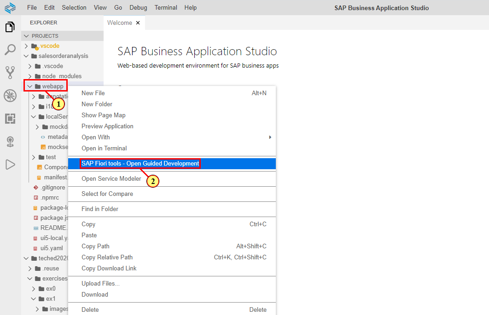
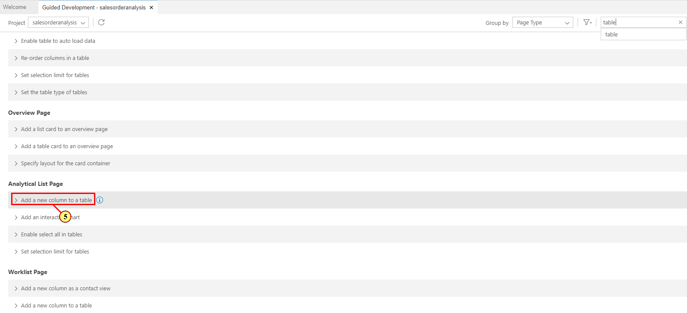
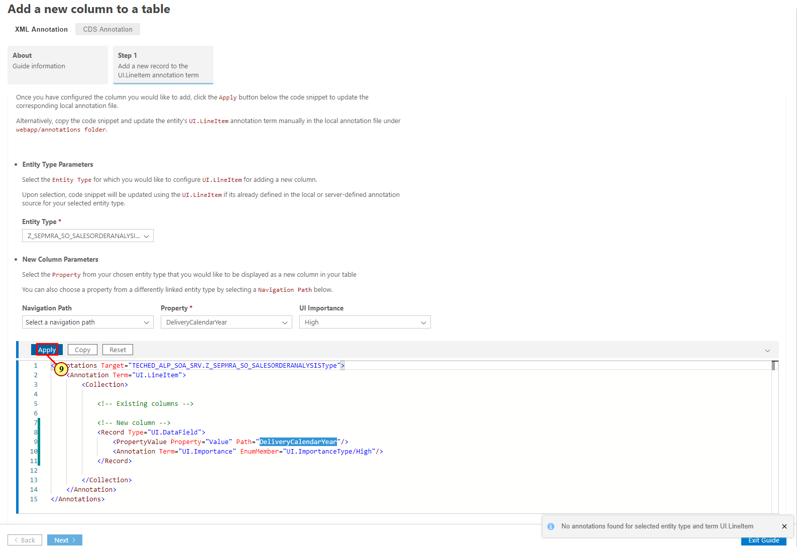
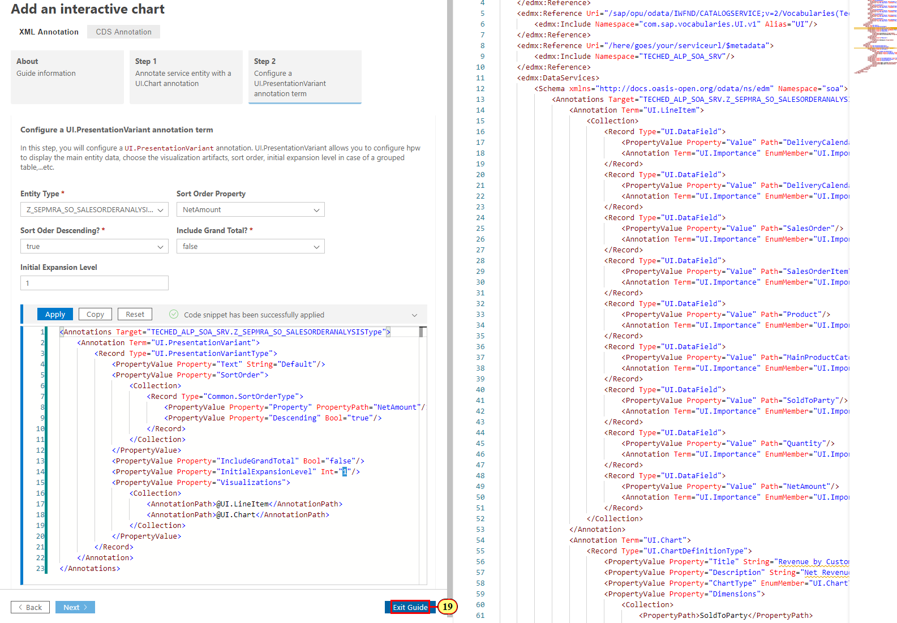
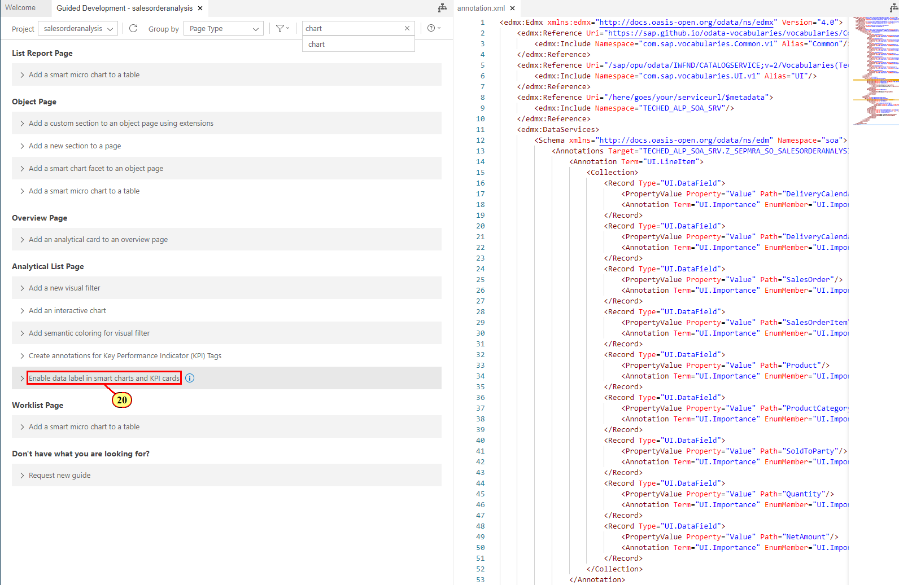
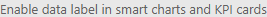
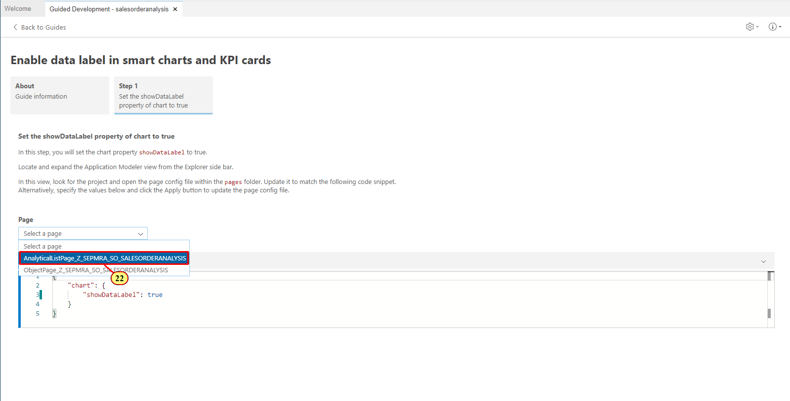
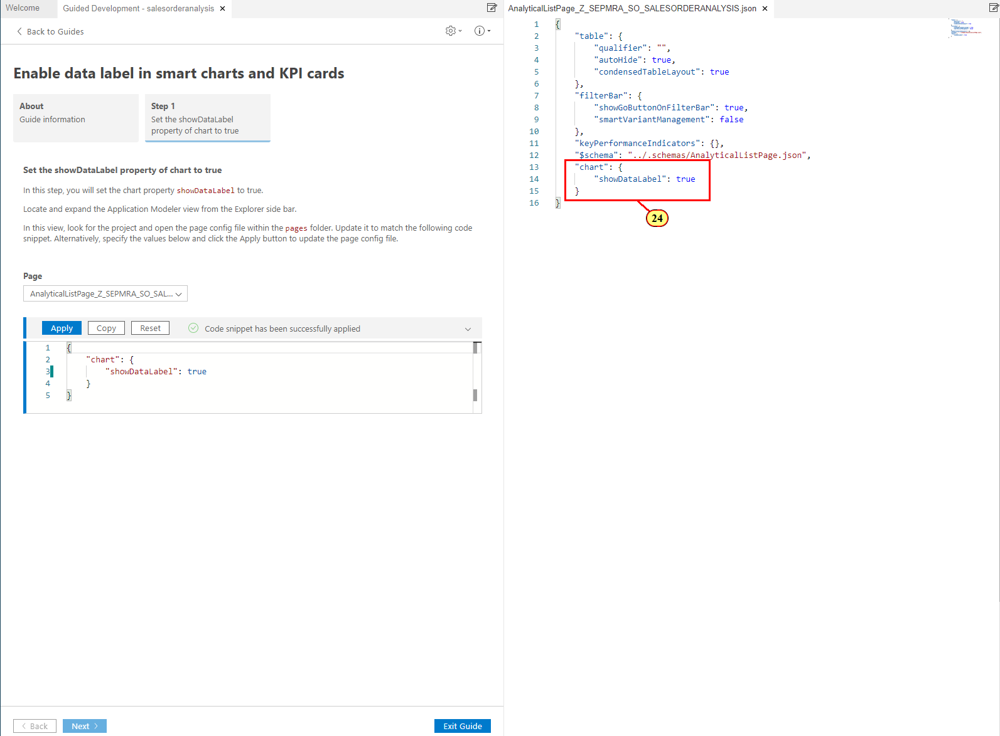
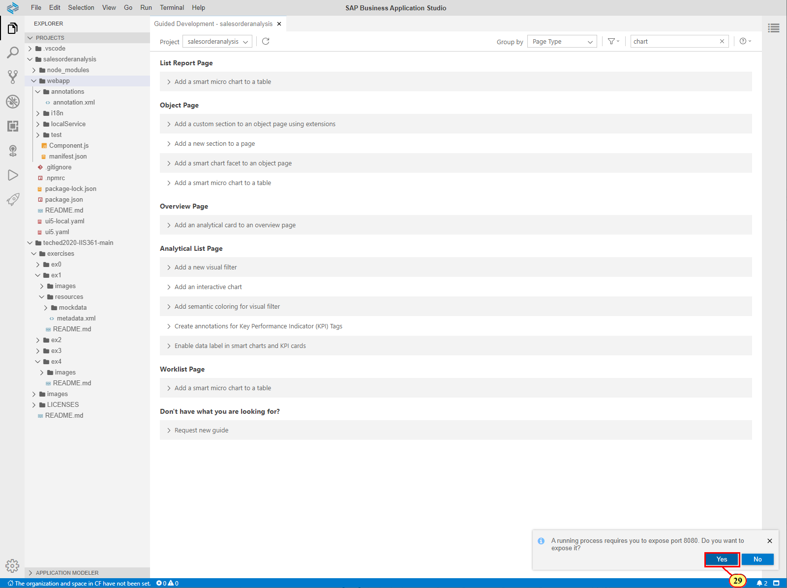

Exercise 2 - Configuring Content Area of Analytical List Page
==============================================================

In this exercise, you will define the content area of the Analytical List Page with Fiori Guided Development. For this, you first have to open the Guided Development tool.



(1) In the **Explorer** pane, right-click on the **webapp**  folder.

(2) Choose **SAP Fiori tools - Open Guided Development** .


(3) (Optional) Double-click on the **Guided Development -
salesorderanalysis** tab to get more editing space by temporarily hiding the **Explorer** pane.

Exercise 2.1 Configuring Table
------------------------------

In this exercise, you will configure the columns displayed in the table of the Analytical List Page. UI annotation 'LineItem' is used to represent the table, with DataField records representing the columns. As you will use the Guided Development tool, you do not need to add this annotation manually, just follow the steps below to configure the table and the respective annotation will be added to or updated in the local annotation file when you choose apply.


(4) To find the guides related to tables, type **table** in the search
field



(5) Scroll to the Analytical List Page group and expand the guide  **Add a new column to a table** .


(6) Read the description and click **Start Guide**.

This simple guide contains just one step adding a column (DataField record) to your table (LineItem). You can repeat this step as many times as needed to add all the columns to the table. If the table (LineItem) is not yet defined in your app, it will be created along with the first column.


(7) In the **Entity Type** field, choose your main entity type **Z_SEPMRA_SO_SALESORDERANALYSIS**.


(8) In the **Property** field, choose **Delivery Calendar Year** as your first column content. The code snippet is adjusted accordingly.



(9) Click **Apply**. Annotation UI.LineItem is added to your local annotation file as configured in the code snippet. This file gets open next to the Guided Development tool.

**Note**: If your selected entity type was already annotated with a UI.LineItem, the configured DataField record (column) would be added to it and a new UI.LineItem would not be created.


Now repeat steps **(8)** and **(9)** to add the records (columns) for the following properties:

-   DeliveryCalendarMonth

-   SalesOrder

-   SalesOrderItem

-   Product

-   MainProductCategory

-   SoldToParty

-   Quantity

-   NetAmount


(11) When the records for all property are added to your LineItem, click **Exit Guide** to get back to the list of available guides.

Exercise 2.2 Configuring Interactive Chart 
------------------------------------------

In this exercise, you will configure the chart to be displayed in the Analytical List Page. Annotation Term \"UI.Chart\" is used to visualize the data in the chart format. As you will use the Guided Development tool, you do not need to add this annotation manually, just follow the steps below to configure the chart and the respective annotation will be added to or updated in the local annotation file when you choose apply.


(11) Filter guides by **chart** in the search field.
 
(12)  Expand the guide **Add an interactive chart**  in the **Analytical List Page** group. 


(13) Click **Start Guide** .


(14) Enter the following values:

 | **Field**             |**Value**
 | --------------------- |----------------------------------
 | Entity Type           |SEPMRA_SO_SALESORDERANALYSISType
 | Chart Title           |Revenue by Customer
 | Chart Description     |Net Revenue by Customer
 | ChartType             |Column
 | Measures property      |NetAmount
 | Dimensions Property   |SoldToParty
 | Dimensions Property   |DeliveryCalendarYear
 
 
 
 


(15) Click **Apply**. UI.Chart annotation is added to your local
annotation file as configured in the code snippet.

Exercise 2.3 Configuring Presentation Variant
------------------------------------------------------------
In this exercise, you will configure a UI.PresentationVariant annotation that is used to display the main content of the Analytical List Page. Here you will assign the chart and table created earlier in this exercise as visualization artifacts and define the sorting order. To do so, you will use the **step 2** of the **Add interactive chart** guide.


(16) Click **Step 2: Configure a UI.PresentationVariant annotation term**.


(17) Enter the following values:

  |**Field**                 |**Value**
  |------------------------- |----------------------------------
  |Entity Type               |SEPMRA_SO_SALESORDERANALYSISType
  |Sort Order Property       |NetAmount
  |Sort Order Descending?    |true
  |Include Grand Total?      |false
  |Initial Expansion Level   |1


(18) Click **Apply**. UI.PresentationVariant annotation is added to your local annotation file as configured in the code snippet.



(19) Click **Exit Guide**.

Exercise 2.4 Configuring Chart Data Label
-----------------------------------------

At this point, the required content for the Analytical List Page is configured and you could start the preview as described in the [Exercise 2.5 Starting Application Preview](../ex2#exercise-25-starting-application-preview). But before you do so, let's enhance the chart view with the data labes indicating the measure values. For this the following manifest setting needs to be defined for your Analytical List Page:

```
"chartSettings": {

    "showDataLabel": true

}
```
However, as there is a dedicated guide in the Guided Development tool, there is no need to do this manually.



(20) In Guided Development tool, expand the guide **Enable data label in smart charts and KPI cards** .


(21) Choose **Start Guide**.

**Note**: As you do not need to make any changes to the annotation file in this exercise, you can close the annotation.xml file to get more space.



(22) In **Page field**, choose the first page in your app **AnalyticalListPage_Z_SEPMRA_SO_SALESORDERANALYSIS**.


(23) Click **Apply**.



(24) A .json file describing the page settings in a compact and technology independent notation opens to the right and the new showDataLabel property is inserted. Any update to this transient file is automatically synchronized with the **webapp/manifest.json** of your application on save.
As auto-save is enabled by default, you do not need to save it manually and can close the .json file now.


(25) Click **Exit Guide**.

Exercise 2.5 Starting Application Preview
-----------------------------------------
In this exercise, you will start the preview of the Analytical List Page to view the content you just configured. Before you perform the steps below, make sure that the pop-ups from the SAP Business Application Studio are allowed in your browser.


(26) To show the Explorer pane, double-click on the tab **Guided Development - salesorderanalysis**.


(27) In the **Explorer** pane, right-click on the **webapp** folder.

(28) In the context menu, click **Preview Application**.



(29) In the pop-up message, click **Yes** to allow exposing the port.


(30) Click **Yes** again to allow exposing the second port. 
Application preview will open in the next tab.


(31) in the **Adapt Filters** pop-up, enter **EUR** in the **Currency** field.

(32) Click **Go**.


The content area of the page displays the chart and table you created. They display the data pre-filtered by the currency value you entered in the pop-up with the required filter field.

Data labes indicating the measure values are displayed above each chart column.

The filter bar area is empty as at this point no visual filters are defined. You will specify them in the next exercise.


(33) You can click the button **Compact Filter**  to view the compact filter bar with the only required field available by default. You will add visual filters and additional compact filter fields in the next exercise.


Summary
-------

You have successfuly annotated the main entity type of your app with UI.LineItem, UI.Chart and UI.PresentationVariant annotations required to display content area of Analytical List Page. You have also updated the app descriptior file (manifest.json) with the showDataLabel setting required to display the measure values in chart.

**Note**: You can compare the contents of your **annotation.xml** and **manifest.json** files with the solutions we prepared for you.  For this, expand the folder **salesorderanalysis\>webapp-\>annotations**, right-click on the  **annotation.xml** file and choose **Select for Compare**. Then expand the folder **teched2020-IIS361-\>exercises-\>ex2-\>solutions_ex2-\>webapp-\>annotations**, right-click on the **annotation.xml** file there and choose **Compare with Selected**. The files will be displayed side by side for comparison. Similarly you can compare the contents of your **manifest.json** file in folder **salesorderanalysis\>webapp** with the respective file in the solutions.

Continue to [Exercise 3 - Configuring Filters in Analytical List Page](../ex3/README.md)
