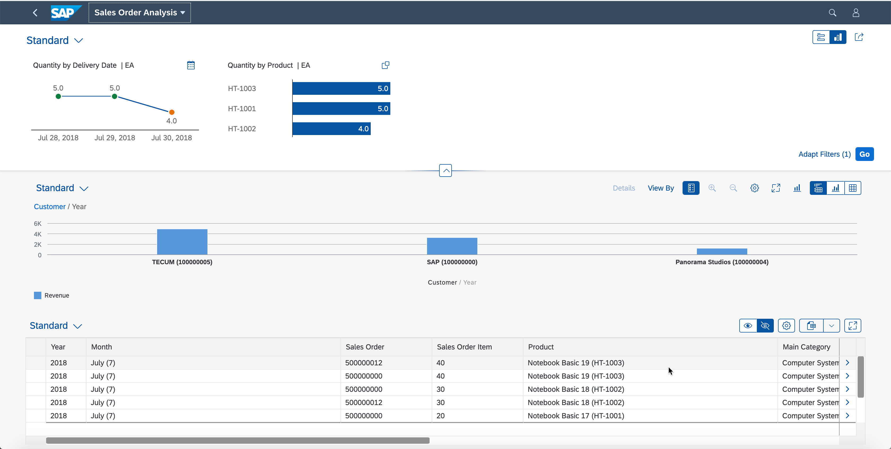
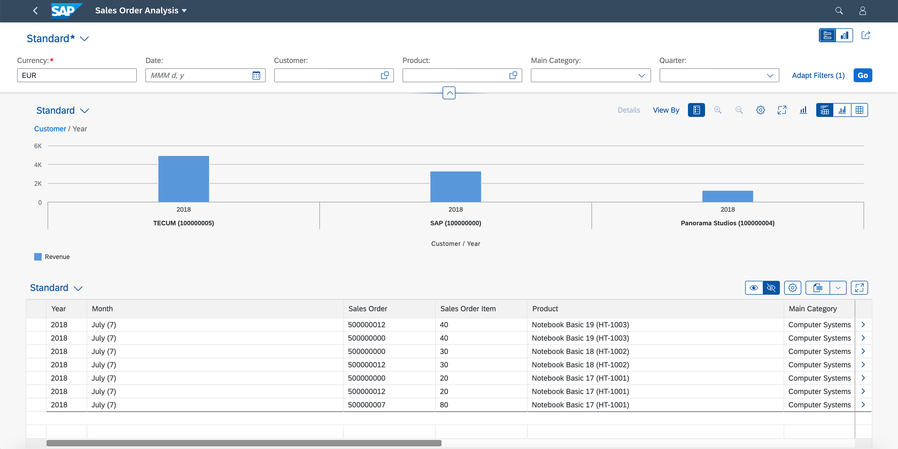

# Configuration of the Filters in Analytical List Page
You will learn to create compact and visual filters in the filter bar of the Analytical List Page.

## Configure Compact Filters
1. Add **UI.SelectionField** as a child of Annotations the from the option

2. Add PropertyPaths for **"DeliveryCalendarDate"**, **"SoldToParty"**, **"Product"**, **"MainProductCategory"**, **"DeliveryCalendarQuarter"**

3. Save the annotation file by clicking the ‘Save’ from File Menu or pressing CTRL/CMD + S. Your final annotation will look like below
```xml
 <Annotation Term="UI.SelectionFields">
    <Collection>
        <PropertyPath>DeliveryCalendarDate</PropertyPath>
        <PropertyPath>SoldToParty</PropertyPath>
        <PropertyPath>Product</PropertyPath>
        <PropertyPath>MainProductCategory</PropertyPath>
        <PropertyPath>DeliveryCalendarQuarter</PropertyPath>
    </Collection>
</Annotation>
```

## Configure Visual Filters
Fiori user experiance recommends the filters to be displayed in a Visual format for better drill down & analysis, such filters are called Visual Filters. Visual Filters can be used selected by an end user as an alternate option to the more conventional compact filters. Visual Filters show the top outliers with respect to measures and thus provide hints to users what are the interesting filter selections. You need to have a ValueHelp entity set to configure a Visual Filter

### Visual Filter - Quantity By Date
1. Create a new Annotations tag as child of Schema definition

2. Select "SEPMRA_SO_ALP_SLDORDERITEMType" as annotation target from suggestion list (You could also use CTRL/CMD + SPACE for opening the options list)

3. Save the annotation file by clicking the ‘Save’ icon or pressing CTRL+S. It should look like below
```xml
<Annotations Target="TECHED_ALP_SOA_SRV.SEPMRA_SO_ALP_SLDORDERITEMType">    

</Annotations>
```
4. Visual Filter is an interactive chart and one needs to create UI.Chart annotation to specify corresponding information

5. Select **UI.Chart** from the options under the newly created annotations

6. Add a **Qualifier** for your UI.Chart annotation and add its value as **"FilterQuantityByDate"**

7. Select the **Charttype** property and set EnumMember as **"UI.ChartType/Line"**

8. Add **Title** property and set String value as **"Quantity by Delivery Date"**

9. Add **Measure** property and set PropertyPath as **"Quantity"**

10. Add **Dimension** property and set the PropertyPath as **"DeliveryDate"**

11. Save the annotation file by clicking the ‘Save’ from File Menu or pressing CTRL/CMD + S. Your final annotation will look like below
```xml
<Annotation Term="UI.Chart" Qualifier="FilterQuantityByDate">
    <Record Type="UI.ChartDefinitionType">
        <PropertyValue Property="ChartType" EnumMember="UI.ChartType/Line"/>
        <PropertyValue Property="Title" String="Quantity by Delivery Date"/>
        <PropertyValue Property="Measures">
            <Collection>
                <PropertyPath>Quantity</PropertyPath>
            </Collection>
        </PropertyValue>
        <PropertyValue Property="Dimensions">
            <Collection>
                <PropertyPath>DeliveryDate</PropertyPath>
            </Collection>
        </PropertyValue>
    </Record>
</Annotation>
```
*Now, you need to reference the chart in a presentation variant to display it in the filter bar*

12. Add **UI.PresentationVariant** as a sibling to UI.Chart annotations

13. Add the **Qualifier** for your UI.PresentationVariant annotation and set its value as **"FilterQuantityByDate"**

14. Add **Visualizations** property in UI.PresentationVariant

15. Add the annotations path, **@UI.Chart#FilterQuantityByDate**

16. Save the annotation file by clicking the ‘Save’ from File Menu or pressing CTRL/CMD + S. Your final annotation will look like below
```xml
<Annotation Term="UI.PresentationVariant" Qualifier="FilterQuantityByDate">
    <Record Type="UI.PresentationVariantType">
        <PropertyValue Property="Visualizations">
            <Collection>
                <AnnotationPath>@UI.Chart#FilterQuantityByDate</AnnotationPath>
            </Collection>
        </PropertyValue>
    </Record>
</Annotation>
```
*Now, you should associate the modeled Visual Filter to the Analytical List Page annotations which are on the entity set 'Z_SEPMRA_SO_SALESORDERANALYSIS’. This is done by associating the above configuration to one of the property from 'Z_SEPMRA_SO_SALESORDERANALYSIS’*

17. Add a new Annotations tag under the Schema and set the target as 'Z_SEPMRA_SO_SALESORDERANALYSISType/DeliveryCalendarDate'

18. Add **Common.ValueList** annotations as a child of the newly created Annotations

19. Under **CollectionPath** property, add the property string value as **"SEPMRA_SO_ALP_SLDORDERITEM"**

20. Add **PresentationVariantQualifier** property set the String as **"FilterQuantityByDate"**

21. Add Record **"ValueListParameterInOut"**

22. Add **LocalDataProperty** as a child of ValueListParameterInOut and set PropertyPath to **"DeliveryCalendarDate"**

23. Add for **ValueListProperty** as a child of ValueListParameterInOut and set String value as **"DeliveryDate"**

24. Save the annotation file by clicking the ‘Save’ from File Menu or pressing CTRL/CMD + S. Your final annotation will look like below
```xml
<Annotations Target="TECHED_ALP_SOA_SRV.Z_SEPMRA_SO_SALESORDERANALYSISType/DeliveryCalendarDate">
    <Annotation Term="Common.ValueList">
        <Record Type="Common.ValueListType">
            <PropertyValue Property="CollectionPath" String="SEPMRA_SO_ALP_SLDORDERITEM"/>
            <PropertyValue Property="PresentationVariantQualifier" String="FilterQuantityByDate"/>
            <PropertyValue Property="Parameters">
                <Collection>
                    <Record Type="Common.ValueListParameterInOut">
                        <PropertyValue Property="LocalDataProperty" PropertyPath="DeliveryCalendarDate"/>
                        <PropertyValue Property="ValueListProperty" String="DeliveryDate"/>
                    </Record>
                </Collection>
            </PropertyValue>
        </Record>
    </Annotation>
</Annotations>
```
*Two things are needed to configure a visual filter:*
*You need to define a chart to be displayed in the filter bar, using a ‘UI.Chart’ annotation. The data displayed in the chart is more aggregated than what is shown in the main content of the page. In our case we display the sum of all sales order amounts by day. Therefore, you use an object which is different from the object used in the main content of the page (‘SEPMRA_SO_ALP_SLDORDERITEMType’ vs. ‘Z_SEPMRA_SO_SALESORDERANALYSIS’)*

*You need to define the mapping between dimensions in the visual filter and properties in the objects displayed in the main content, so that clicking on a dimension value the visual filter will filter the main content accordingly. In our case, we had to map the date property in ‘SEPMRA_SO_ALP_SLDORDERITEMType’ to the date in ‘Z_SEPMRA_SO_SALESORDERANALYSIS’, for the visual filter to work properly. This is what the ‘ValueList’ annotation is used for*

### Visual Filter - Quantity By Product
In this step, you will add a second visual filter. The configuration is similar to what you’ve already done for the first visual filter in the previous step (definition of the chart & mapping to the property from main entity set)

1. Extend the Annotations for target SEPMRA_SO_ALP_SLDORDERITEMType and add **UI.Chart** (Press CTRL/CMD + SPACE to open the option list)

2. Add a **Qualifier** for your UI.Chart annotation and set its value as **"FilterQuantityByProduct"**

3. Add **ChartType** property and set the EnumMember **"UI.ChartType/Bar"**

4. Add **Title** property to the newly added UI.Chart and set the String attribute to **"Quantity by Product"**

5. Add **Measure** property and set the PropertyPath as **"Quantity"**

6. Add **Dimension** property and set the PropertyPath as **"Product"**

7. Save the annotation file by clicking the ‘Save’ from File Menu or pressing CTRL/CMD + S. Your final annotation will look like below
```xml
<Annotation Term="UI.Chart" Qualifier="FilterQuantityByProduct">
    <Record Type="UI.ChartDefinitionType">
        <PropertyValue Property="ChartType" EnumMember="UI.ChartType/Bar"/>
        <PropertyValue Property="Title" String="Quantity by Product"/>
        <PropertyValue Property="Measures">
            <Collection>
                <PropertyPath>Quantity</PropertyPath>
            </Collection>
        </PropertyValue>
        <PropertyValue Property="Dimensions">
            <Collection>
                <PropertyPath>Product</PropertyPath>
            </Collection>
        </PropertyValue>
    </Record>
</Annotation>
```
*Now, you need to reference the chart in a presentation variant to display it in the filter bar*

10. Add **UI.PresentationVariant** and set the **Qualifier** attributes as **"FilterQuantityByProduct"**

11. Add **Visualizations** property to UI.PresentationVariant

12. Add the AnnotationsPath tag and set the value as **@UI.Chart#FilterQuantityByProduct**

13. Save the annotation file by clicking the ‘Save’ from File Menu or pressing CTRL/CMD + S. Your final annotation will look like below
```xml
<Annotation Term="UI.PresentationVariant" Qualifier="FilterQuantityByProduct">
    <Record Type="UI.PresentationVariantType">
        <PropertyValue Property="Visualizations">
            <Collection>
                <AnnotationPath>@UI.Chart#FilterQuantityByProduct</AnnotationPath>
            </Collection>
        </PropertyValue>
    </Record>
</Annotation>
```
*Now, let’s map the 2 product properties in the 2 objects we used*

14. Add a new Annotations under Schema and set the target as Z_SEPMRA_SO_SALESORDERANALYSISType/Product

15. Add **Common.ValueList** under the Annotations

16. Add **CollectionPath** property under Common.ValueList and set String value as **"SEPMRA_SO_ALP_SLDORDERITEM"**

17. Add **PresentationVariantQualifier** property and set the attribute String as **"FilterQuantityByProduct"**

18. Add Parameters property which is of type Collection of Record

19. Add a Record of Type **"ValueListParameterInOut"**

20. Add PropertyValue & set the Property to **LocalDataProperty** and set the PropertyPath as **"Product"**

21. Add PropertyValue & set the Property to **ValueListProperty** and set the PropertyPath as **"Product"**

22. Save the annotation file by clicking the ‘Save’ from File Menu or pressing CTRL/CMD + S.Your final annotation will look like below
```xml
<Annotations Target="TECHED_ALP_SOA_SRV.Z_SEPMRA_SO_SALESORDERANALYSISType/Product">
    <Annotation Term="Common.ValueList" >
        <Record Type="Common.ValueListType">
            <PropertyValue Property="CollectionPath" String="SEPMRA_SO_ALP_SLDORDERITEM"/>
            <PropertyValue Property="PresentationVariantQualifier" String="FilterQuantityByProduct"/>
            <PropertyValue Property="Parameters">
                <Collection>
                    <Record Type="Common.ValueListParameterInOut">
                        <PropertyValue Property="LocalDataProperty" PropertyPath="Product"/>
                        <PropertyValue Property="ValueListProperty" String="Product"/>
                    </Record>
                </Collection>
            </PropertyValue>
        </Record>
    </Annotation>
</Annotations>
```

## Configure Semantic Coloring
In this step, you will define the criticality coloring to the visual filter bar based on the sales order items. Criticality annotations allows you to define the improvement direction by specifying different ranges and when the actual values cross those boundaries specified application, Visual Filterbar charts displays criticality coloring to display the situation

1. Extend the Annotations for target SEPMRA_SO_ALP_SLDORDERITEMType and add **UI.DataPoint** (You can open the option list by pressing CTRL/CMD + SPACE)

2. Add **Qualifier** for your UI.DataPoint annotation and set its value as **"Quantity"**

3. Add a child annotation with name PropertyValue & set the Property attribute as **Value**. Add another attribute path and set as **"Quantity"**

4. At the same level add another PropertyValue & set the property attribute to **CriticalityCalculation**

5. Add PropertyValue as child & set Property to **ImprovementDirection**. Add EnumMember attribute & set **"UI.ImprovementDirectionType/Maximize"**

6. Add another PropertyValue & set Property to **ToleranceRangeLowValue**. Add Int attribute & set as **"5"**

7. Add another PropertyValue & set Property to **ToleranceRangeLowValue**. Add Int attribute & set as **"4"**

8. Save the annotation file by clicking the ‘Save’ from File Menu or pressing CTRL/CMD + S. Your final annotation will look like below
```xml
<Annotation Term="UI.DataPoint" Qualifier="Quantity">
    <Record Type="UI.DataPointType">
        <PropertyValue Property="Value" Path="Quantity"/>
        <PropertyValue Property="CriticalityCalculation">
            <Record Type="UI.CriticalityCalculationType">
                <PropertyValue Property="ImprovementDirection" EnumMember="UI.ImprovementDirectionType/Maximize"/>
                <PropertyValue Property="ToleranceRangeLowValue" Int="5"/>
                <PropertyValue Property="DeviationRangeLowValue" Int="4"/>
            </Record>
        </PropertyValue>
    </Record>
</Annotation>
```
*Criticality configurations are annotated in the above instructions. Now you need to associate this configuration to the Chart annotation created for representing the Visual Filter which is described below*

8. Add a PropertyValue **MeasureAttributes** to the **UI.Chart#FilterQualityByDate**

9. Add a child PropertyValue **DataPoint** to the MeasureAttribute & set the AnnotationPath as **@UI.DataPoint#Quantity**

10. Add child PropertyValue **Measure** to the MeasureAttribute & PropertyPath as **"Quantity"**

11. Save the annotation file by clicking the ‘Save’ from File Menu or pressing CTRL/CMD + S. Your final UI.Chart annotation will look like below
```xml
<Annotation Term="UI.Chart" Qualifier="FilterQuantityByDate">
    <Record Type="UI.ChartDefinitionType">
        <PropertyValue Property="ChartType" EnumMember="UI.ChartType/Line"/>
        <PropertyValue Property="Title" String="Quantity by Delivery Date"/>
        <PropertyValue Property="Measures">
            <Collection>
                <PropertyPath>Quantity</PropertyPath>
            </Collection>
        </PropertyValue>
        <PropertyValue Property="Dimensions">
            <Collection>
                <PropertyPath>DeliveryDate</PropertyPath>
            </Collection>
        </PropertyValue>
        <PropertyValue Property="MeasureAttributes">
            <Collection>
                <Record Type="UI.ChartMeasureAttributeType">
                    <PropertyValue Property="Measure" PropertyPath="Quantity"/>
                    <PropertyValue Property="DataPoint" AnnotationPath="@UI.DataPoint#Quantity"/>
                </Record>
            </Collection>
        </PropertyValue>
    </Record>
</Annotation>
```

## Run the App
In this step, you will preview the application. Right click on webapp and choose Preview Application from the menu (or refresh the tab containing the running app).
The app loads in the popup that opens up. Type ‘EUR’ as the currency and click on ‘Go’. Click on the ‘Compact filter’ mode in the header to display the compact filters.







## Summary
You have successfully learned how to create Visual Filters and configure Criticality visualization as well. To continue the exercise please go to [Configuration of the Object Page](../ex4/README.md)


