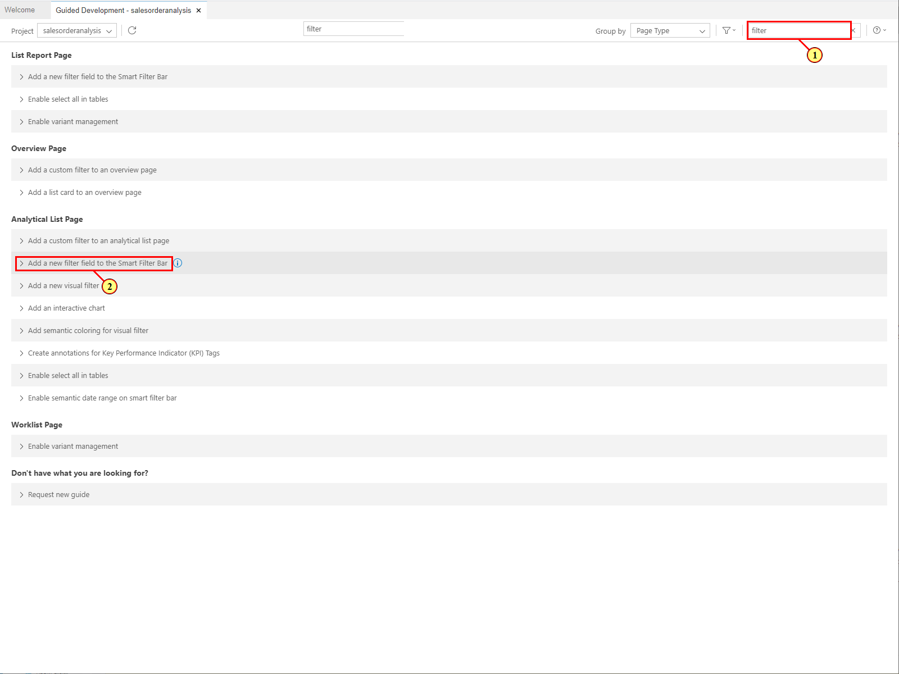
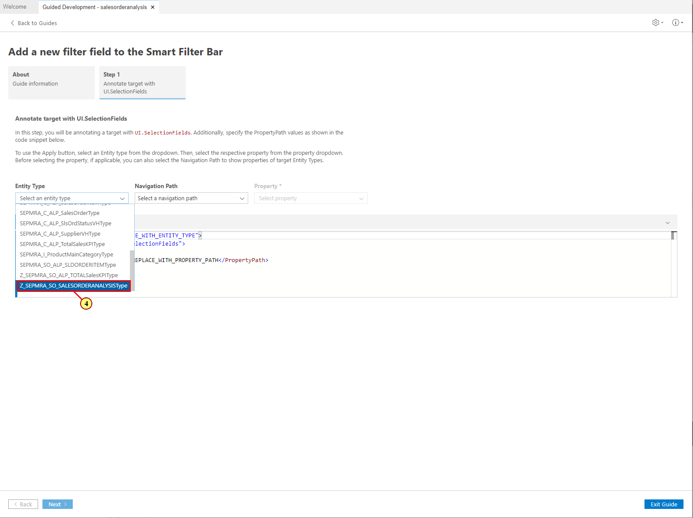
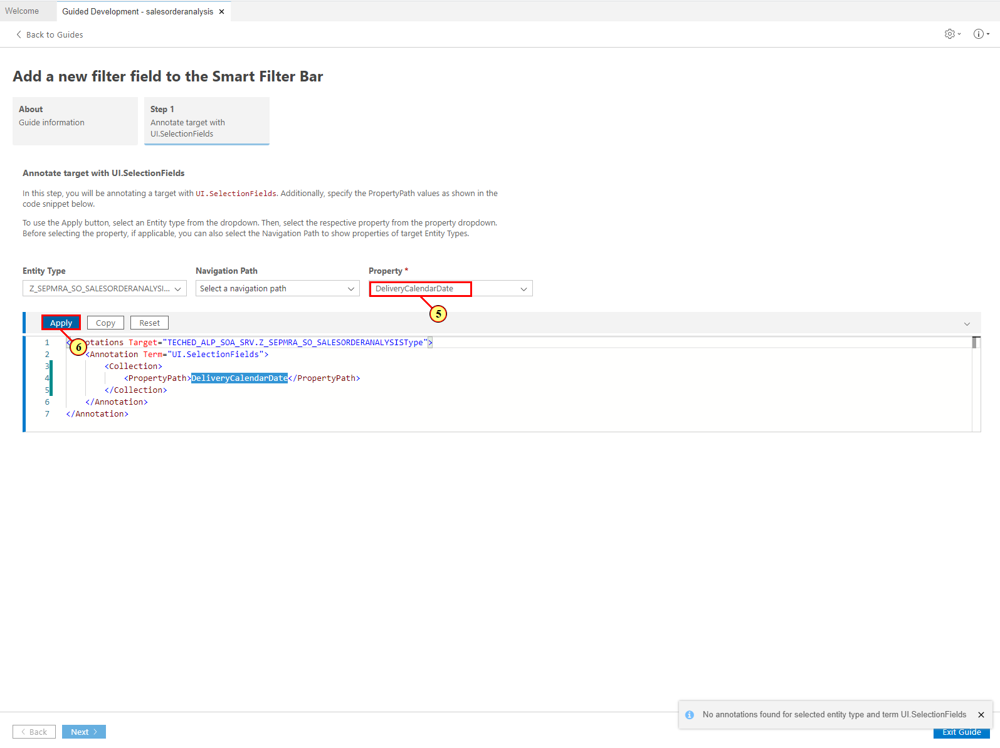
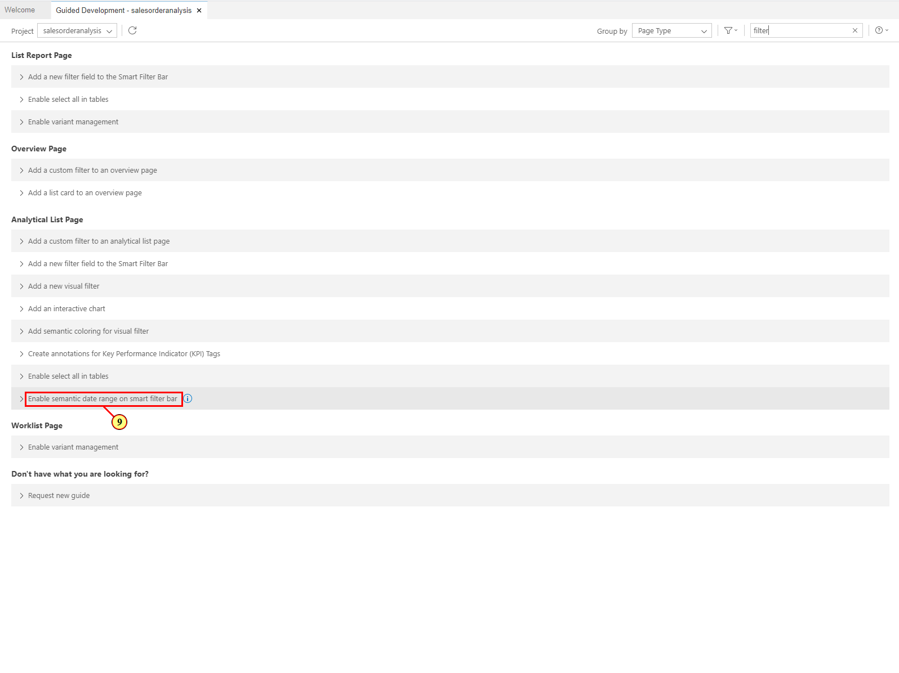
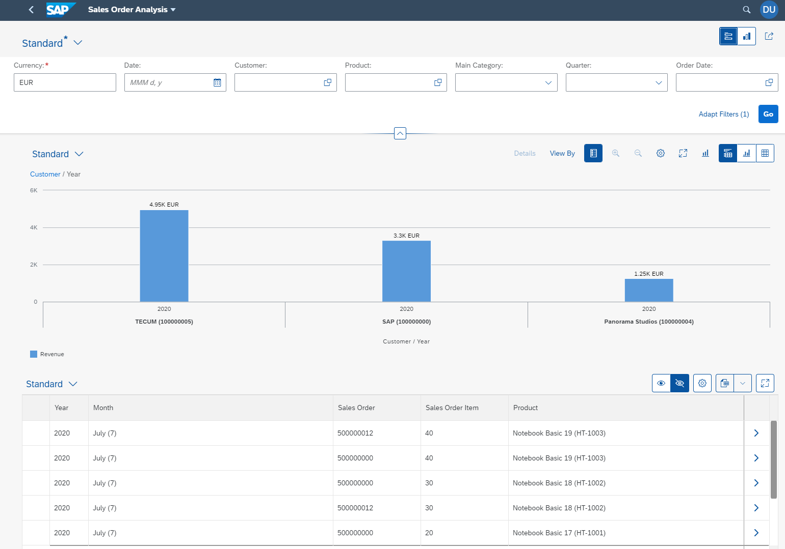
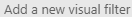
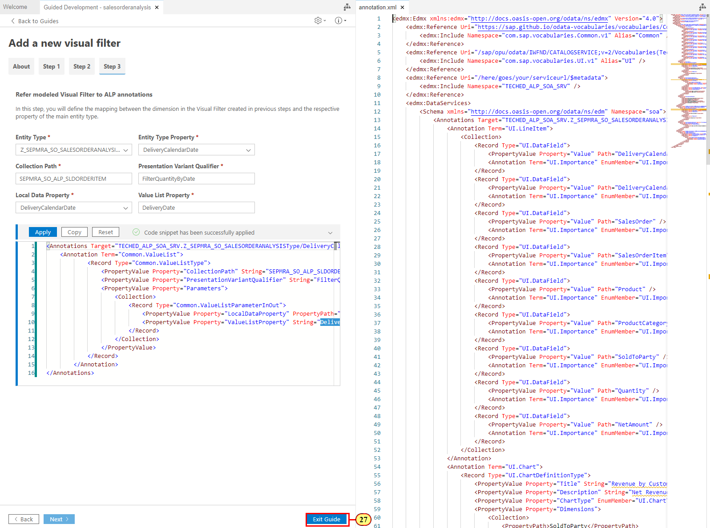
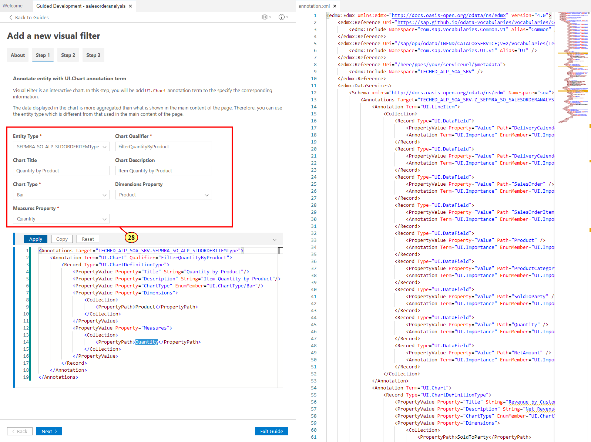
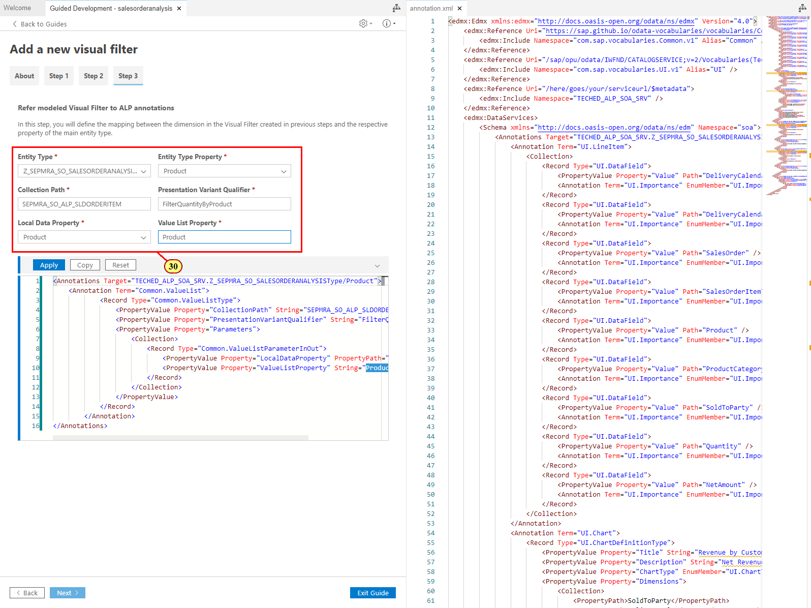
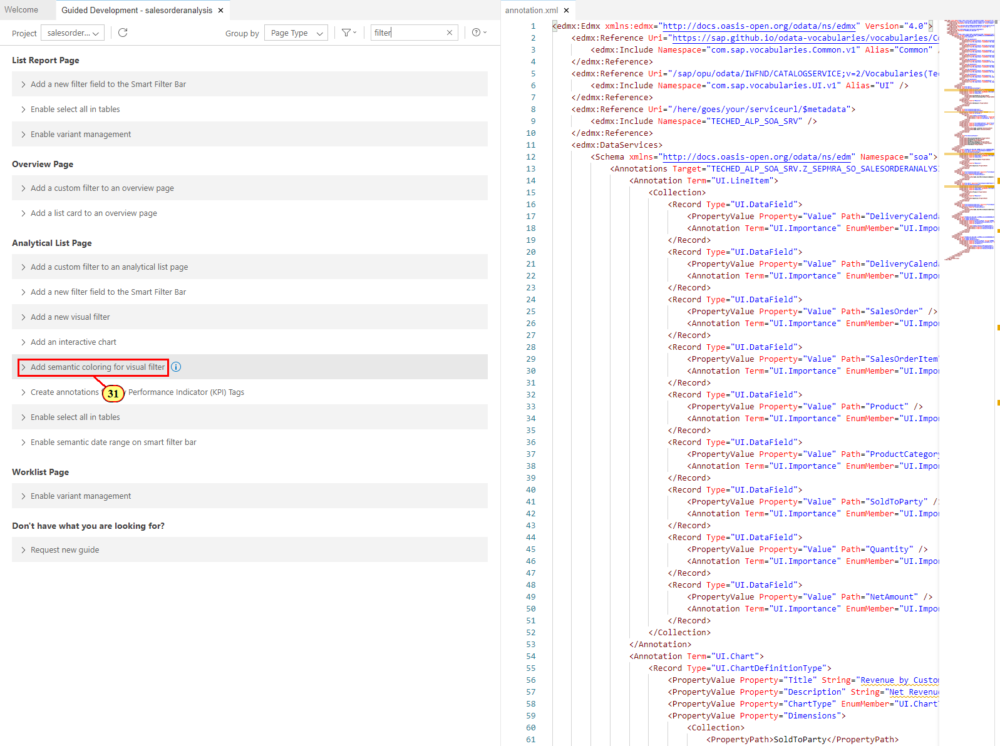

Exercise 3 -- Configure Filters in Analytical List Page
=========================================================

In this exercise, you will define the filter area of the Analytical List Page.

Exercise 3.1 Configuring Compact Filter 
--------------------------------------

In this exercise, you will configure a UI.SelectionFields annotation that is used to display the filter fields in the compact filter bar of of the Analytical List Page.

(1) In the Guided Development Tab of SAP Business Application Studio, enter **filter** in the search field and expand the guide **Add a new filter field to the Smart Filter Bar**  **under the Analytical List Page group.**

(2) Click **Start Guide**.

(3) In the **Entity Type** field, select **Z_SEPMRA_SO_SALESORDERANALYSISType**.

(4) in the **Property** field, select **DeliveryCalendarDate**.

(5) Click **Apply**. Annotation UI.SelectionFields is added to your local annotation file as configured in the code snippet.

(6) The local annotation file opens next to the Guided Development tool not yet there. You can scroll it down to view the added annotation.

Now repeat steps (4) and (5) to add the filter ields for the following properties:

-   SoldToParty

-   Product

-   MainProductCategory

-   DeliveryCalendarQuarter

(7) Whenthe fields for all properties are added to your UI.SelectionFields annotation, click **Exit Guide** to get back to the list of available guides.

You can now switch to the tab containing the running app to view the result. If you already stopped the preview after the previous exercise, you can start it again as described in Exercise 2.4 Start the Application Preview

**Note**: Do not forget to click the **Compact Filter**
button** ** to view the updated filter bar

Exercise 3.2 Configuring Visual Filter with Line Chart 
------------------------------------------------------

In this exercise, you will configure a UI.Chart, UI.PresentationVariant and Common.ValueList annotations that are used to display the visual filters. For this you will use the guide Add Visual Filter that consists of 3 steps.

Fiori user experiance recommends the filters to be displayed in a Visual format for better drill down and analysis. Visual Filters can be used by an end user as an alternate option to the more conventional compact filters. Visual Filters show the top outliers with respect to measures and thus provide hints to users what are the interesting filter selections. You need to have a ValueHelp entity set to configure a Visual Filter

(8) In Guided Development, open the guide **Add a new visual filter **.

(9) Click **Start Guide**.

(10)  In the first step, you define a chart to be displayed in the filter bar, using a 'UI.Chart' annotation. Enter the following values:

  **Field**             **Value**
  --------------------- --------------------------------
  Entity Type           SEPMRA_SO_ALP_SLDORDERITEMType
  Chart Qualifier       FilterQuantityByDate
  Chart Title           Quantity by Delivery Date
  Chart Description     Item Quantity by Delivery Date
  Chart Type            Line
  Dimensions Property   DeliveryDate
  Measures Property     Quantity

**Note**: The data displayed in the chart is more aggregated than what is shown in the main content of the page. In this case you display the sum of all sales order amounts by day. Therefore, you **use an entity type that is different** from the entity type used in the main content of the page

(11) Click **Apply**. UI.Chart annotation is added to the local annotation file.

(12) Click **Next** to get to the second step of the guide. In that step, you will reference the chart in a presentation variant so that it could be displayed it in the filter bar.

(13) Enter the following values:

  **Field**                        **Value**
  -------------------------------- ----------------------------------
  Entity Type                      SEPMRA_SO_ALP_SLDORDERITEMType
  Presentation Variant Qualifier   FilterQuantityByDate
  Chart Qualifier                  \@UI.Chart\#FilterQuantityByDate

**Note**: Here you use the same entity type as in the previous step.

(14) Click **Apply**.

(15) Click **Next** to get to the second step of the guide.

In that step, you will define the mapping between dimensions in the visual filter and properties in the objects displayed in the main content, so that clicking on a dimension value the visual filter will filter the main content accordingly. In this case, you have to map the date property in **SEPMRA_SO_ALP_SLDORDERITEMType** to the date in **Z_SEPMRA_SO_SALESORDERANALYSIS** for the visual filter to work properly. For this, you use the Common.ValueList annotation.

(16) Enter the following values:

  **Field**                       |    **Value**
  --------------------------------|  ------------------------------------
  | Entity Type                   |  Z_SEPMRA_SO_SALESORDERANALYSISType
  | Entity Type Property          |  DeliveryCalendarDate
  | Collection Path               |  SEPMRA_SO_ALP_SLDORDERITEM
  | Presentation Variant Qualifier|  FilterQuantityByDate
  | Local Data Property           |  DeliveryCalendarDate
  | Value List Property           |  DeliveryDate

**Note**: Here you annotate the property of your main entity type.

**Note**: Value list Property must contain the property you used as dimension in the chart configured in step 1 of the guide.

(17) Click **Apply**.

(18) Click **Exit Guide**.

At this point your visual filter is configured and you can switch to the browser tab with application preview. Enter **EUR** as a currency in the pop up and click **Go** to view the result.

Exercise 3.3 Configuring Visual Filter with Bar Chart 
-----------------------------------------------------

In this exercise, you will go through the similar steps to create one more visual filter, this time as a bar chart.

To start, repeat the steps (8) and (9) above to start the guide **Add a new visual filter**.

In **step 1** of the guide, use the following values to create a chart as described in [Exercise 3.2](#exercise-3.2-configuring-visual-filter-with-line-chart) steps (10)-(12).

 |  **Field**             |         **Value**
 |  --------------------- |  --------------------------------
 |  Entity Type           | SEPMRA_SO_ALP_SLDORDERITEMType
 |  Chart Qualifier       | FilterQuantityByProduct
 |  Chart Title           | Quantity by Product
 |  Chart Description     | Item Quantity by Product
 |  Chart Type            | Bar
 |  Dimensions Property   | Product
 |  Measures Property     | Quantity

In **step 2** of the guide, use the following values to reference that chart in a presentation variant as in steps (13) - (15) above.

  | **Field**                        | **Value**
  | -------------------------------- | -------------------------------------
  | Entity Type                      | SEPMRA_SO_ALP_SLDORDERITEMType
  | Presentation Variant Qualifier   | FilterQuantityByProduct
  | Chart Qualifier                  | \@UI.Chart\#FilterQuantityByProduct

**Note**: Here you use the same entity type as in the previous step.

In **step 3** of the guide, use the following values to map the dimensions in the chart to the respective property of your main entity type in the annotation Common.ValueList as in steps (16) - (18) above.

  | **Field**                        | **Value**
  | -------------------------------- | --------------------------------
  | Entity Type                      | Z_SEPMRA_SO_SALESORDERANALYSIS
  | Entity Type Property             | Product
  | Collection Path                  | SEPMRA_SO_ALP_SLDORDERITEM
  | Presentation Variant Qualifier   | FilterQuantityByProduct
  | Local Data Property              | Product
  | Value List Property              | Product

**Note**: Here you annotate the property of your main entity type.

**Note**: Value list Property must contain the property you used as dimension in the chart configured in step 1 of the guide.

When you are done with all three steps, your second visual filter is configured and you can switch to the browser tab with application preview. Enter **EUR** as a currency in the pop up and click **Go** to view the result.

Exercise 3.4 Configuring Semantic Coloring
------------------------------------------

In this step, you will define the criticality coloring to the visual filter bar based on the sales order items. Criticality annotations allows you to define the improvement direction by specifying different ranges and when the actual values cross those boundaries specified application, Visual Filterbar charts displays criticality coloring to display the situation

(19) In Guidede Development, expand the guide **Add semantic coloring for visual filter **.

(20) Click **Start Guide**.

(21) In the step 1, configure the DataPoint annotation using the following values:

 |  **Field**                | **Value**
 |  ------------------------ | --------------------------------
 |  Entity Type              | SEPMRA_SO_ALP_SLDORDERITEMType
 |  Data Point Qualifier     | Quantity
 | Data Point Value          | Quantity
 |  Improvement Direction    | Maximize
 | ToleranceRangeLowValue    | 5
 | DeviationRangeLowValue    | 4

(22) Click **Apply**.

(23) Click **Step 2**.

**Note**: You can also click **Next** at the bottom of the guide to go to the next step.

(24) In Step 2, update the chart you defined for the visual filter in [Exercise 3.2](#exercise-3.2-configuring-visual-filter-with-line-chart) as follows:

 |  **Field**                               |  **Value**
 |  ----------------------------------------|  --------------------------------
 |  Entity Type                             | SEPMRA_SO_ALP_SLDORDERITEMType
 | Chart Qualifier                          | FilterQuantityByDate
 | Chart Title                              | Quantity by Delivery Date
 | Chart Description                        | Item Quantity by Delivery Date
 | Chart Type                               | Line
 | Dimensions Property                      | DeliveryDate
 | Measures Property                        | Quantity
 | **Chart Measures Attributes Property**   | **Quantity**
 | **Data Point Qualifier**                 | **\@UI.DataPoint\#Quantity**

(25) Click **Apply**.

At this point you have configured the semantic coloring for the visual filter with the Line chart.

Exercise 3.5 Starting the Application Preview
------------------------------------------

In this exercise, you will start the preview of the Analytical List Page to view the filters you just configured.
**Note**: make sure that the pop-ups from the SAP Business Application Studio are allowed in your browser.

(26) In the Explorer pane, right-click on **webapp** folder.

(27) Select **Preview Application**.

(28) Enter **EUR** into the **Currency** field and click **Go**.

Summary
-------

You have learned how to create Visual Filters and define the semantic coloring for its elements. In the next exercise, you will configure the Object Page.
