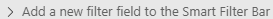
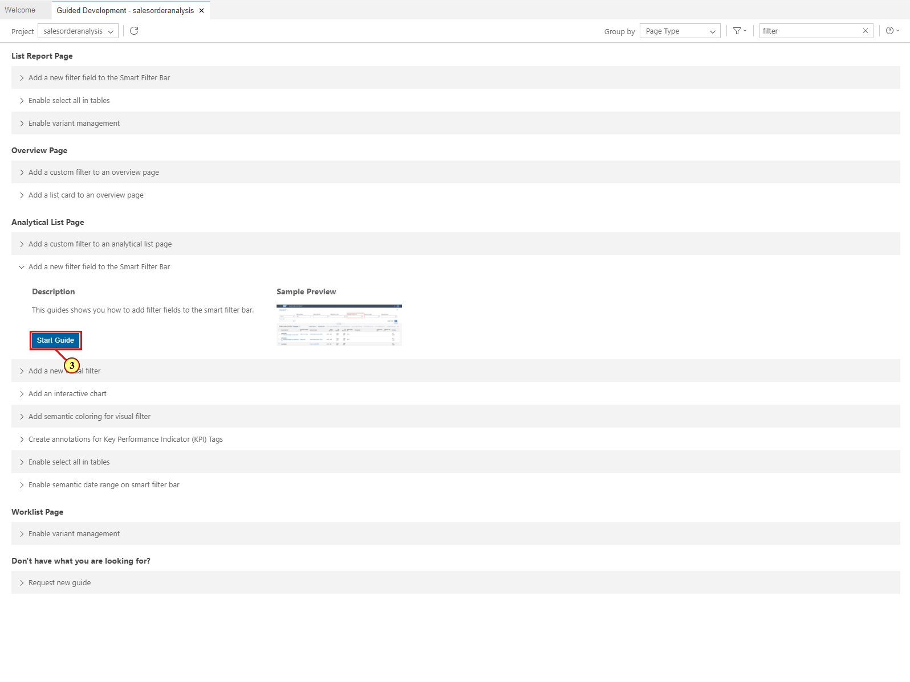
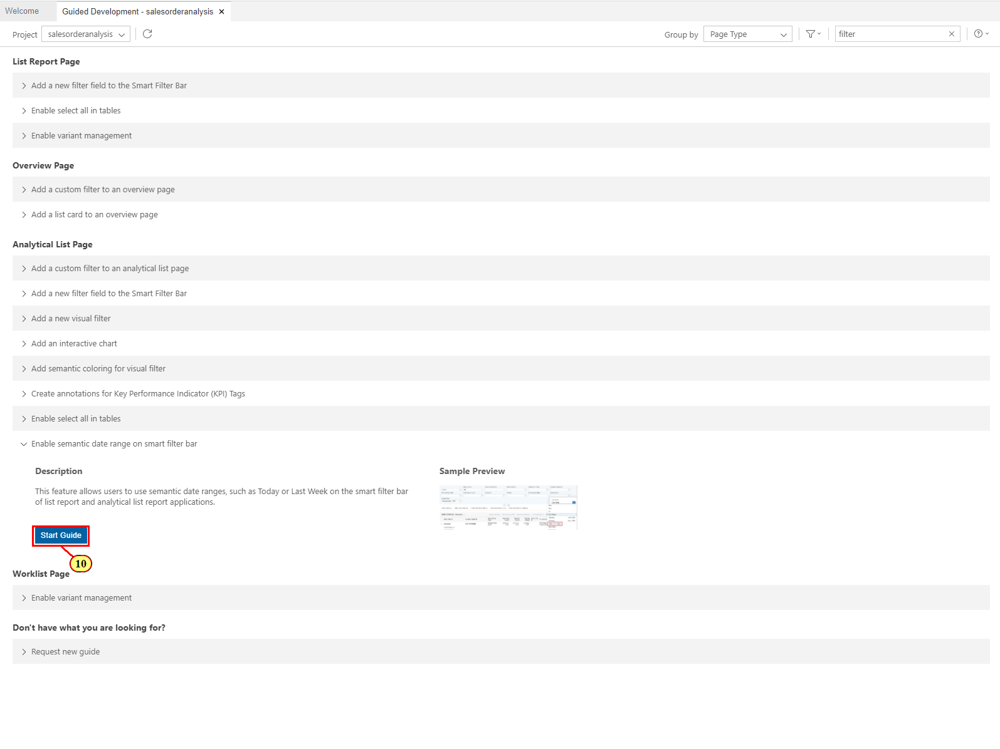
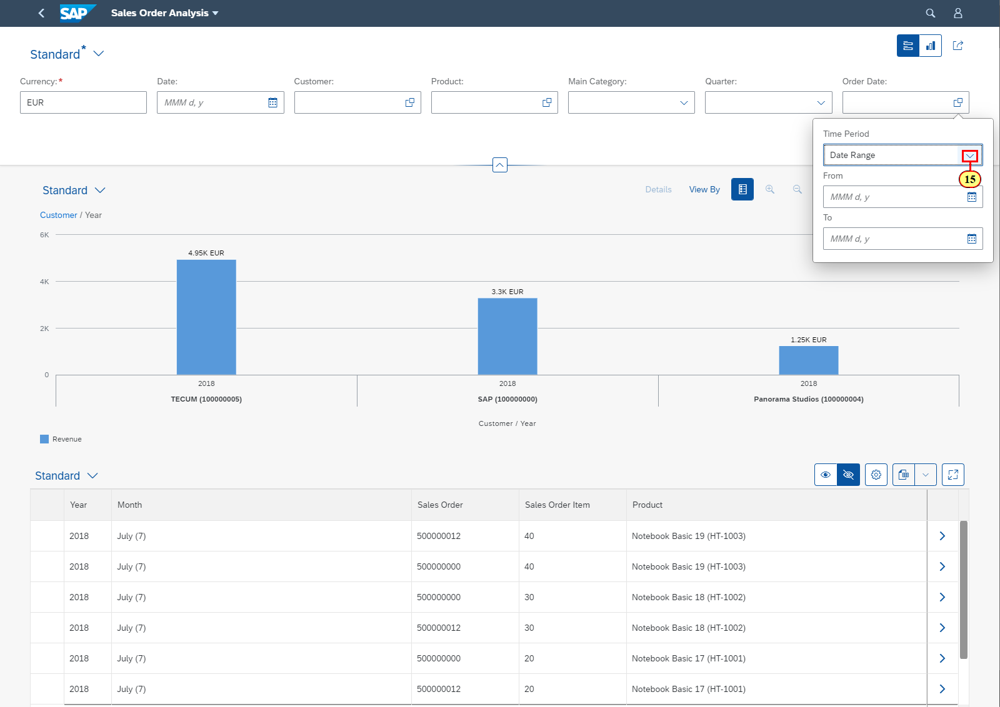

Exercise 3 -- Configuring Filters in Analytical List Page
=========================================================

In this exercise, you will define the filter area of the Analytical List
Page using the Guided Development tool. Open this tool as in [Exercise 2 - Configuring Content Area of Analytical List Page](../ex2#exercise-2---configure-content-area-in-analytical-list-page).

Exercise 3.1 Configuring Compact Filter 
--------------------------------------

In this exercise, you will configure a UI.SelectionFields annotation
that is used to display the filter fields in the compact filter bar of
of the Analytical List Page.


(1) In the **Guided Development** tab of SAP Business Application
Studio, enter **filter** in the search field.

(2) Expand the guide **Add a new filter field to the Smart Filter Bar**

 under the **Analytical List Page** group.



(3) Click **Start Guide**.


(4) In the **Entity Type** field, select
**Z_SEPMRA_SO_SALESORDERANALYSISType**.


(5) In the **Property** field, choose **Delivery Calendar Date** as your
first column content. The code snippet is adjusted accordingly.

 

(6) Click **Apply**. Annotation UI.SelectionFields is added to your
local annotation file as configured in the code snippet.


(7) Now repeat steps (5) and (6) to add the filter fields for the
following properties:

-   SoldToParty

-   Product

-   MainProductCategory

-   DeliveryCalendarQuarter

-   Order Date


(8) When the fields for all properties are added to your
UI.SelectionFields annotation, click **Exit Guide** to get back to the
list of available guides.

You can now switch to the tab containing the running app to view the
result. If you already stopped the preview after the previous exercise,
you can start it again as described in [Exercise 2.5 Starting Application Preview](../ex2#exercise-25-starting-application-preview).

**Note**: Do not forget to click the **Compact Filter**
button  to view the updated filter bar.


Exercise 3.2 Configuring Semantic Date Range
--------------------------------------------

In this this exercise, you will configure the semantic representation
for the date range filter fields. Semantic date range representation is
supported for fields which are of type : **DateTime**, with **Date**
display type and have interval selection enabled. For this, the
following manifest setting needs to be defined for your Analytical List
Page:

```

"filterSettings": {
      "dateSettings":{
           "useDateRange": true
      }
}
```
However, as there is a dedicated guide in the Guided Development tool,
there is no need to do this manually.


(9) In Guided Development tool,  expand the guide **Enable semantic date
range on smart filter bar**

 under the **Analytical List Page** group.



(10) Click **Start Guide**.


(11) In the **Page** field, choose the first page in your app
**AnalyticalListPage_Z\_SEPMRA_SO_SALESORDERANALYSIS**.

(12) Click **Apply**.


(13) A .json file with page settings in opens to the right and the new
date setting is inserted. This update is automatically synchronized with
the **webapp/manifest.json** of your application on save. As auto-save
is enabled by default, you do not need to save it manually and can close
the .json file now.

(14) Click **Exit Guide**.



You can now switch to the tab containing the running app to view the
result. If you already stopped the preview after the previous exercise,
you can start it again as described in [Exercise 2.5 Starting Application Preview](../ex2#exercise-25-starting-application-preview).

(15) Open the value help in the **Order Date** filter. In the pop-up,
open the drop-down list of the Time Period field and choose a desired
date range. To filter this content, choose either last 2 quarters, last 6 months or this year.


(16) Click **Go**. The data will be filtered based on your selection


Exercise 3.3 Configuring Visual Filter with Line Chart 
------------------------------------------------------

In this exercise, you will configure a UI.Chart, UI.PresentationVariant
and Common.ValueList annotations that are used to display the visual
filters. For this you will use the guide Add Visual Filter that consists
of 3 steps.

Fiori user experiance recommends the filters to be displayed in a Visual
format for better drill down and analysis. Visual Filters can be used by
an end user as an alternate option to the more conventional compact
filters. Visual Filters show the top outliers with respect to measures
and thus provide hints to users what are the interesting filter
selections. You need to have a ValueHelp entity set to configure a
Visual Filter


(17) In **Guided Development** tool, open the guide **Add a new visual
filter** .


(18) Click **Start Guide**.


(19) In the first step, you define a chart to be displayed in the filter
bar, using a `UI.Chart` annotation. Enter the following values:

  |**Field**             |**Value**
  |--------------------- |--------------------------------
  |Entity Type           |SEPMRA_SO_ALP_SLDORDERITEMType
  |Chart Qualifier       |FilterQuantityByDate
  |Chart Title           |Quantity by Delivery Date
  |Chart Description     |Item Quantity by Delivery Date
  |Chart Type            |Line
  |Dimensions Property   |DeliveryDate
  |Measures Property     |Quantity

**Note**: The data displayed in the chart is more aggregated than what
is shown in the main content of the page. In our case we display the sum
of all sales order amounts by day. Therefore, you **use an entity type
that is different** from the entity type used in the main content of the
page

(20) Click **Apply**. UI.Chart annotation is added to the local
annotation file.


(21) Click **Step 2.**

**Note:** You can also click **Next** at the bottom of the guide to go
to the next step.

In that step, you will reference the chart in a presentation variant so
that it could be displayed it in the filter bar.


(22) Enter the following values:

  |**Field**                        |**Value**
  |-------------------------------- |----------------------------------
  |Entity Type                      |SEPMRA_SO_ALP_SLDORDERITEMType
  |Presentation Variant Qualifier   |FilterQuantityByDate
  |Chart Reference                  |\@UI.Chart\#FilterQuantityByDate

**Note**: Here you use the same entity type as in the previous step.

(23) Click **Apply**.


(24) Click  **Step 3** at the top or **Next** at the bottom to get to
the last step of the guide.

In that step, you will define the mapping between dimensions in the
visual filter and properties in the objects displayed in the main
content, so that clicking on a dimension value the visual filter will
filter the main content accordingly. In this case, you have to map the
date property in **SEPMRA_SO_ALP_SLDORDERITEMType** to the date in
**Z_SEPMRA_SO_SALESORDERANALYSIS** for the visual filter to work
properly. For this, we use the Common.ValueList annotation.


(25) Enter the following values:

  |**Field**                        |**Value**
  |-------------------------------- |------------------------------------
  |Entity Type                      |Z_SEPMRA_SO_SALESORDERANALYSISType
  |Entity Type Property             |DeliveryCalendarDate
  |Collection Path                  |SEPMRA_SO_ALP_SLDORDERITEM
  |Presentation Variant Qualifier   |FilterQuantityByDate
  |Local Data Property              |DeliveryCalendarDate
  |Value List Property              |DeliveryDate

**Note**: Here you annotate the property of your **main** entity type.

**Note**: **Value list Property** must contain the property you used as
dimension in the chart configured in step 1 of the guide.

(26) Click **Apply**.


(27) Click **Exit Guide**.

At this point your visual filter is configured and you can start the
application preview as described in [Exercise 2.5 Starting Application Preview](../ex2#exercise-25-starting-application-preview). The visual filter is displayed. You can filter the content by selecting any of the points in the line chart and clicking **Go**.


Exercise 3.4 Configuring Visual Filter with Bar Chart 
-----------------------------------------------------

In this exercise, you will go through the similar steps to create one
more visual filter, this time as a bar chart.

To start, repeat the steps (17) and (18) above to start the guide **Add
a new visual filter**.


(28) In **step 1** of the guide, use the following values to create a
chart as described in steps (19)-(20) of the Exercise 3.3 Configuring Visual Filter with Line Chart .

  |**Field**             |**Value**
  |--------------------- |--------------------------------
  |Entity Type           |SEPMRA_SO_ALP_SLDORDERITEMType
  |Chart Qualifier       |FilterQuantityByProduct
  |Chart Title           |Quantity by Product
  |Chart Description     |Item Quantity by Product
  |Chart Type            |Bar
  |Dimensions Property   |Product
  |Measures Property     |Quantity


(29) In **step 2** of the guide, use the following values to reference
that chart in a presentation variant as in steps (22) - (23) above.

  |**Field**                        |**Value**
  |-------------------------------- |-------------------------------------
  |Entity Type                      |SEPMRA_SO_ALP_SLDORDERITEMType
  |Presentation Variant Qualifier   |FilterQuantityByProduct
  |Chart Reference                  |\@UI.Chart\#FilterQuantityByProduct

**Note**: Here you use the same entity type as in the previous step.


(30) In **step 3** of the guide, use the following values to map the
dimensions in the chart to the respective property of your main entity
type in the annotation Common.ValueList as in steps (25) - (26) above.

  |**Field**                        |**Value**
  |-------------------------------- |--------------------------------
  |Entity Type                      |Z_SEPMRA_SO_SALESORDERANALYSIS
  |Entity Type Property             |Product
  |Collection Path                  |SEPMRA_SO_ALP_SLDORDERITEM
  |Presentation Variant Qualifier   |FilterQuantityByProduct
  |Local Data Property              |Product
  |Value List Property              |Product

**Note**: Here you annotate the property of your main entity type.

**Note**: Value list Property must contain the property you used as
dimension in the chart configured in step 1 of the guide.

When you are done with all three steps, your second visual filter is
configured and you can start the application preview as described in [Exercise 2.5 Starting Application Preview](../ex2#exercise-25-starting-application-preview). Enter **EUR** as a currency in the pop up and click **Go** to view the result. The second visual filter in is displayed as a bar chart.


Exercise 3.5 Configuring Semantic Coloring
------------------------------------------

In this step, you will define the criticality coloring to the visual
filter bar based on the sales order items. Criticality annotations
allows you to define the improvement direction by specifying different
ranges and when the actual values cross those boundaries specified
application, Visual Filterbar charts displays criticality coloring to
display the situation


(31) In Guided Development, expand the guide **Add semantic coloring for
visual filter** 


(32) Click **Start Guide**.


(33) In the **step 1**, configure the DataPoint annotation using the
following values:

  |**Field**                |**Value**
  |------------------------ |--------------------------------
  |Entity Type              |SEPMRA_SO_ALP_SLDORDERITEMType
  |Data Point Qualifier     |Quantity
  |Data Point Value         |Quantity
  |Improvement Direction    |Maximize
  |ToleranceRangeLowValue   |5
  |DeviationRangeLowValue   |4

(34) Click **Apply**.


(35) Click on the **step 2** to get to the next step.


(36) In **Step 2**, re-define the already existing UI.Chart annotation
used to display your visual filter (Exercise 3.3) with the reference to
the Data Point annotation defiled in the previous step. For your
convenience, the newly added properties are highlighted bold:

  |**Field**                                |**Value**
  |---------------------------------        |-----------------------------
  |Entity Type                              |SEPMRA_SO_ALP_SLDORDERITEMType
  |Chart Qualifier                          |FilterQuantityByDate
  |Chart Title                              |Quantity by Delivery Date
  Chart Description                         |Item Quantity by Delivery Date
  |Chart Type                               |Line
  |Dimensions Property                      |DeliveryDate
  |Measures Property                        |Quantity
  |**Chart Measures Attributes Property**   |**Quantity**
  |**Data Point Qualifier**                 |**\@UI.DataPoint\#Quantity**

(37) Click **Apply**.

**Note**: As an alternative to steps 36 and 37, you can update the
existing line chart annottation directly in annotation.xml file using
the code completion. This is a faster option for experienced users.

a.  In annotation.xml file, find line chart.

b.  Add a new line after the last `</PropertyValue>` tag.

c.  Use **CTRL+Space** (Windows) or **CMD+Space** (Mac) to get a suggestion list.

d.  Choose `<Property MeasureAttributes>`


e.  Use **CTRL+Space** (Windows) or **CMD+Space** (Mac) again to add DataPoint.


f.  And then again to choose **UI.DataPoint\#Quantity** as its value.

g.  Use the code completion again to add the property **Measures** and assign **Quantity** as a value. In the end, your annotation for line chart should look like this:

```
<Annotation Term="UI.Chart" Qualifier="FilterQuantityByDate">
    <Record Type="UI.ChartDefinitionType">
        <PropertyValue Property="Title" String="Quantity by Delivery Date" />
        <PropertyValue Property="Description" String="Item Quantity by Delivery Date" />
        <PropertyValue Property="ChartType" EnumMember="UI.ChartType/Line" />
        <PropertyValue Property="Dimensions">
            <Collection>
                <PropertyPath>DeliveryDate</PropertyPath>
            </Collection>
        </PropertyValue>
        <PropertyValue Property="Measures">
            <Collection>
                <PropertyPath>Quantity</PropertyPath>
            </Collection>
        </PropertyValue>
        <PropertyValue Property="MeasureAttributes">
            <Collection>
                <Record Type="UI.ChartMeasureAttributeType">
                    <PropertyValue Property="DataPoint" AnnotationPath="@UI.DataPoint#Quantity"/>
                    <PropertyValue Property="Measure" PropertyPath="Quantity"/>
                </Record>
            </Collection>
        </PropertyValue>
    </Record>
</Annotation>

```
At this point you have configured the semantic coloring for the visual filter with the Line chart. Start the preview to see the changes in your visual filter based on the line chart. The data points are highlighted with semantic colors. 


Exercise 3.6 Using Shortcuts
----------------------------

In this step, you will get acquainted with the shortcuts that are available in Analtytical List Page.

When the keyboard focus is on any element in the visual filter panel or on the entire visual filter, pressing **CTRL + Enter** (Windows) or **CMD + Enter** (Mac) triggers Go / Search action.


Switch over to the Compact Filter view. When the keyboard focus is on any filter field on the SmartFilterbar,
Press **Enter** or **Return** to trigger Go / Search action.


Summary
-------

You have learned how to create Visual Filters and define the semantic coloring for its elements using annotations. You have also learned how to configure the semantic date range for the date fields in the compact filter with manifest settings.

**Note**: You can compare the contents of your **annotation.xml** and **manifest.json** files with the solutions we prepared for you.  For this, expand the folder **salesorderanalysis\>webapp-\>annotations**, right-click on the  **annotation.xml** file and choose **Select for Compare**. Then expand the folder **teched2020-IIS361-\>exercises-\>ex3-\>solutions_ex3-\>webapp-\>annotations**, right-click on the **annotation.xml** file there and choose **Compare with Selected**. The files will be displayed side by side for comparison. Similarly you can compare the contents of your **manifest.json** file in folder **salesorderanalysis\>webapp** with the respective file in the solutions.


In the next exercise, you will prepare for translation the text you defined for UI elements. Continue to  Exercise 4 - Preparing texts for translation [Exercise 4 - Preparing texts for translation](../ex4/README.md).
