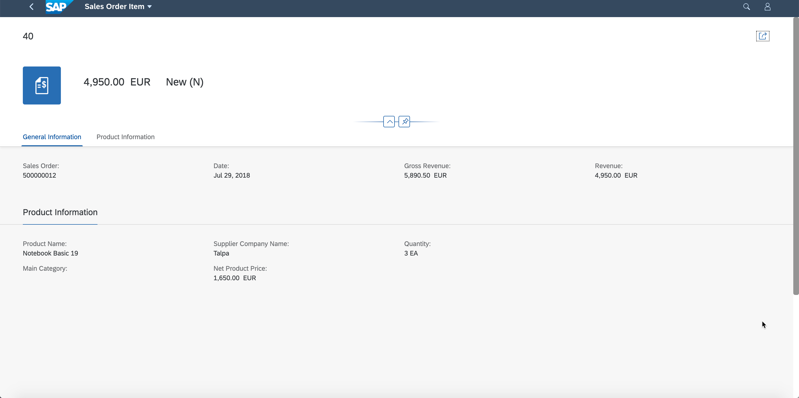

# CONFIGURATION OF THE SECOND PAGE (OBJECT PAGE)
In this part, you will create the annotations to display the header and content for the Object page

## Define the content of the header
In this step, you will define the information that will be displayed in the header of the object page: the ID of the sales order item and an icon

1. Extend the annotation Z_SEPMRA_SO_SALESORDERANALYSISType and add **UI.HeaderInfo** annotation

2. Add **TypeName** property, set String value as **"Sales Order Item"**

3. Add **TypeNamePlural** property, set String value as **"Sales Order Items"**

4. Add  **TypeImageUrl** property and set String value as **"sap-icon://sales-order-item"**

5. Add **Title** property

6. Choose **"DataField"** record as a child of the Title

7. Add **Value** property and set Path as **"SalesOrderItem"**

Save the annotation file by clicking the ‘Save’ from File Menu or pressing CTRL/CMD + S. Your final annotation will look like below.

```xml
<Annotation Term="UI.HeaderInfo" >
    <Record Type="UI.HeaderInfoType">
        <PropertyValue Property="TypeName" String="Sales Order Item"/>
        <PropertyValue Property="TypeNamePlural" String="Sales Order Items"/>
        <PropertyValue Property="Title">
            <Record Type="UI.DataField">
                <PropertyValue Property="Value" Path="SalesOrderItem"/>
            </Record>
        </PropertyValue>
        <PropertyValue Property="TypeImageUrl" String="sap-icon://sales-order-item"/>
    </Record>
</Annotation>
```

## Display the net amount and status in the header

In this step, you will add 2 additional pieces of information in the header: the net amount corresponding to the sales order item, and the status

1. Add **UI.DataPoint** as a child of Annotation under target Z_SEPMRA_SO_SALESORDERANALYSISType

2. Set Qualifier for  UI.DataPoint annotation as **"NetAmount"**

3. Add a child annotation with name PropertyValue & set the Property attribute as **Value**. Add another attribute path and set as **"NetAmount"**

4. Repeat steps 1 - 3 for creating another DataPoint annotation

5. Keep the new DataPoint's qualifier as **Status** and Value as **"SalesOrderStatus"**

Save the annotation file by clicking the ‘Save’ from File Menu or pressing CTRL/CMD + S. Your final annotation will look like below

```xml
<Annotation Term="UI.DataPoint" Qualifier="NetAmount">  
    <Record Type="UI.DataPointType">
        <PropertyValue Property="Value" Path="NetAmount"/>
    </Record>
</Annotation>
<Annotation Term="UI.DataPoint" Qualifier="Status">
    <Record Type="UI.DataPointType">
        <PropertyValue Property="Value" Path="SalesOrderOverallStatus"/>
    </Record>
</Annotation>
```

Now, you need to reference the 2 DataPoints in HeaderFacets to display them in the header

1. Add a **UI.HeaderFacets** annotation as a sibling to the above DataPoint annotations

2. Add a **ReferenceFacet** as its child collection

3. Choose AnnotationPath as **@UI.DataPoint#NetAmount** for property **Target**

4. Repeat steps 2 - 3 for creating another **ReferenceFacet** annotation and set its **Target** property to AnnotationPath as **@UI.DataPoint#Status**

Save the annotation file by clicking the ‘Save’ from File Menu or pressing CTRL/CMD + S. Your final annotation will look like below

```xml
<Annotation Term="UI.HeaderFacets" >
    <Collection>
        <Record Type="UI.ReferenceFacet">
            <PropertyValue Property="Target" AnnotationPath="@UI.DataPoint#NetAmount"/>
        </Record>
        <Record Type="UI.ReferenceFacet">
            <PropertyValue Property="Target" AnnotationPath="@UI.DataPoint#Status"/>
        </Record>
    </Collection>
</Annotation>
```
*A ReferenceFacet node is used to reference another node in the annotation file, that defines the information you want to display (a DataPoint in our case)*

*The HeaderFacets node is the parent for all the ReferenceFacet nodes that you want to display in the header of the ObjectPage*

*You can also notice that the revenue figure automatically comes with a currency*

*This is due to annotations already configured for you in the metadata.xml file: the NetAmount and Currency properties are tied together using the sap:unit and sap:semantics annotations*

## Add forms in the body of the object page

In this step, you will define 2 sections in the ObjectPage that displays information about the sales order item and its related product in a form.

First, you need to define the first form that contains information about a sales order item

1. As a sibling of UI.HeaderFacet annotation, add **UI.FieldGroup** annotation

2. Set the **Qualifier** for your UI.FieldGroup annotation as **"General"**

3. Add **Data** property as child of FieldGroupType. This is a collection of records

4. Add **DataField** record

5. Add a property for the DataField as **Value** and set its Path as **"SalesOrder"**

6. Repeat steps 4 - 5 for creating DataField for properties **"DeliveryCalendarDate"**, **"GrossAmount"** and **"NetAmount"**

Save the annotation file by clicking the ‘Save’ from File Menu or pressing CTRL/CMD + S. Your final annotation will look like below


```xml
<Annotation Term="UI.FieldGroup" Qualifier="General">
    <Record Type="UI.FieldGroupType">
        <PropertyValue Property="Data">
            <Collection>
                <Record Type="UI.DataField">
                    <PropertyValue Property="Value" Path="SalesOrder"/>
                </Record>
                <Record Type="UI.DataField">
                    <PropertyValue Property="Value" Path="DeliveryCalendarDate"/>
                </Record>
                <Record Type="UI.DataField">
                    <PropertyValue Property="Value" Path="GrossAmount"/>
                </Record>
                <Record Type="UI.DataField">
                    <PropertyValue Property="Value" Path="NetAmount"/>
                </Record>
            </Collection>
        </PropertyValue>
    </Record>
</Annotation>
```
Now, you’re going to create the second form to display product information.</br>

1. Add another **UI.FieldGroup** annotation as sibling for the above FieldGroup annotation

2. Set the **Qualifier** for your UI.FieldGroup annotation as **"Product"**

3. Add **Data** property as child of FieldGroupType. This is a collection of records

4. Add **DataField** record

5. Add a property for the DataField as **Value** and set its Path as **"ProductName"**

6. Repeat steps 4 - 5 for creating DataField for properties **"MainProductCategory"**, **"SupplierCompanyName"**, **"NetProductPrice"** and **"Quantity"**

Save the annotation file by clicking the ‘Save’ from File Menu or pressing CTRL/CMD + S. Your final annotation will look like below</br>
```xml
<Annotation Term="UI.FieldGroup" Qualifier="Product">
    <Record Type="UI.FieldGroupType">
        <PropertyValue Property="Data">
            <Collection>
                <Record Type="UI.DataField">
                    <PropertyValue Property="Value" Path="ProductName"/>
                </Record>
                <Record Type="UI.DataField">
                    <PropertyValue Property="Value" Path="MainProductCategory"/>
                </Record>
                <Record Type="UI.DataField">
                    <PropertyValue Property="Value" Path="SupplierCompanyName"/>
                </Record>
                <Record Type="UI.DataField">
                    <PropertyValue Property="Value" Path="NetProductPrice"/>
                </Record>
                <Record Type="UI.DataField">
                    <PropertyValue Property="Value" Path="Quantity"/>
                </Record>
            </Collection>
        </PropertyValue>
    </Record>
</Annotation>
```
Finally, you are going to create the 2 sections that references the 2 forms you’ve just created.

1. Add **UI.Facets** as a sibling to the FieldGroup annotation just created. Facet is a collection of ReferenceFacets.

2. Add **ReferenceFacet** record

3. Add a child property to the ReferenceFacet as **Target** and set its AnnotationPath as **@UI.FieldGroup#General**

4. Add another child property to the ReferenceFacet as **Label** set as String **"General Information"**

5. Repeat steps 2 - 3 for creating another ReferenceFacet record. Set **Target** property as AnnotationPath **@UI.FieldGroup#Product**

6. Set its **Label** as String **"Product Information"**</br>

Save the annotation file by clicking the ‘Save’ from File Menu or pressing CTRL/CMD + S. Your final annotation will look like below

```xml
            <Annotation Term="UI.Facets" >
                <Collection>
                    <Record Type="UI.ReferenceFacet">
                        <PropertyValue Property="Target" AnnotationPath="@UI.FieldGroup#General"/>
                        <PropertyValue Property="Label" String="General Information"/>
                    </Record>
                    <Record Type="UI.ReferenceFacet">
                        <PropertyValue Property="Target" AnnotationPath="@UI.FieldGroup#Product"/>
                        <PropertyValue Property="Label" String="Product Information"/>
                    </Record>
                </Collection>
            </Annotation>
```

## RUN THE APP

In this step, you will preview the application. Right click on webapp and choose Preview Application from the menu (or refresh the tab containing the running app).
Once the app loads, type ‘EUR’ as the currency and click on ‘Go'. Navigate to the ObjectPage by clicking on the navigation indicator ( ‘>’ at the end of a row) for a sales order item in the table.



