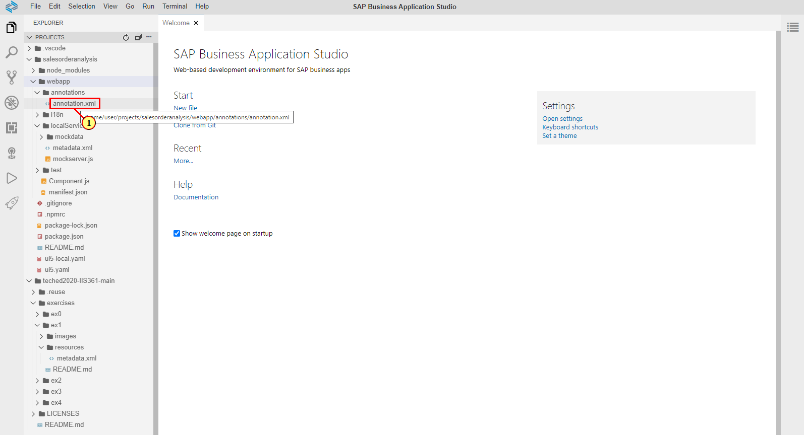
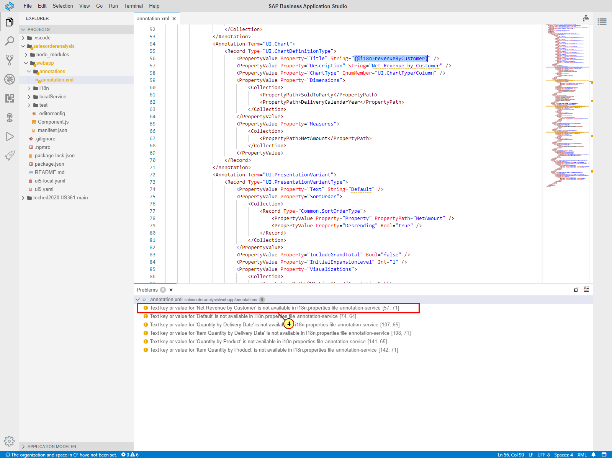
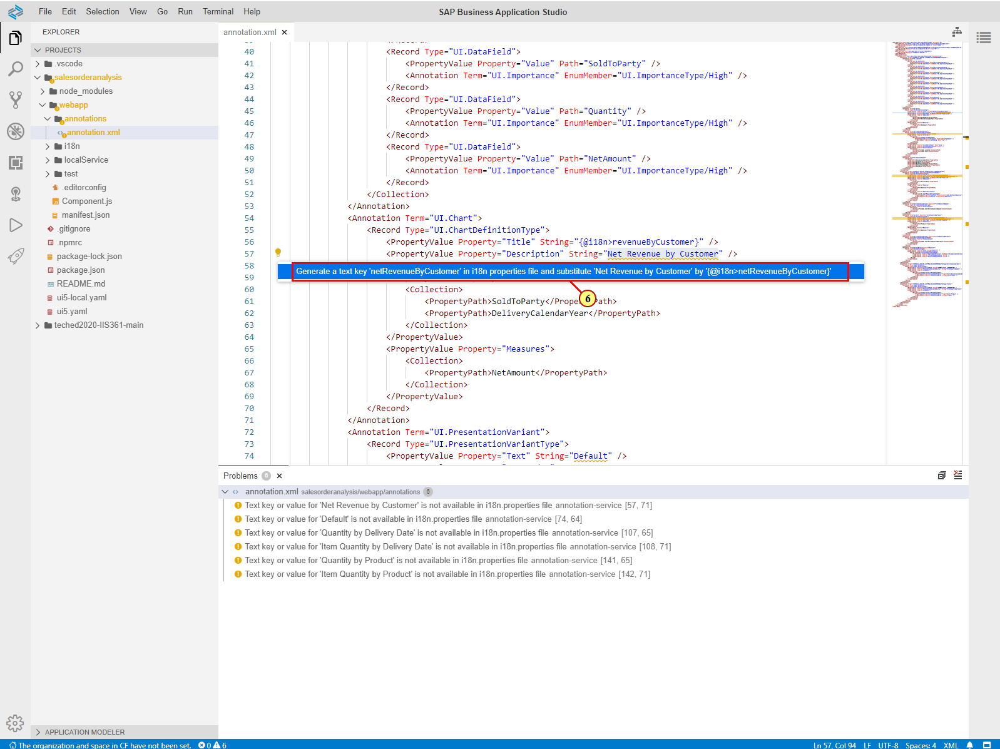
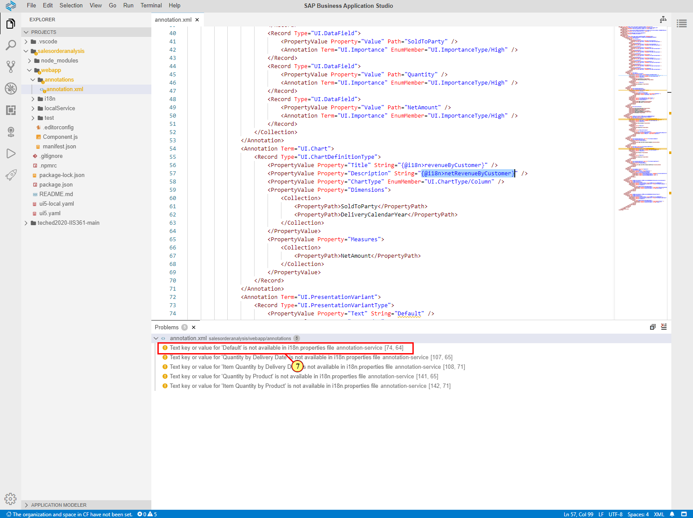
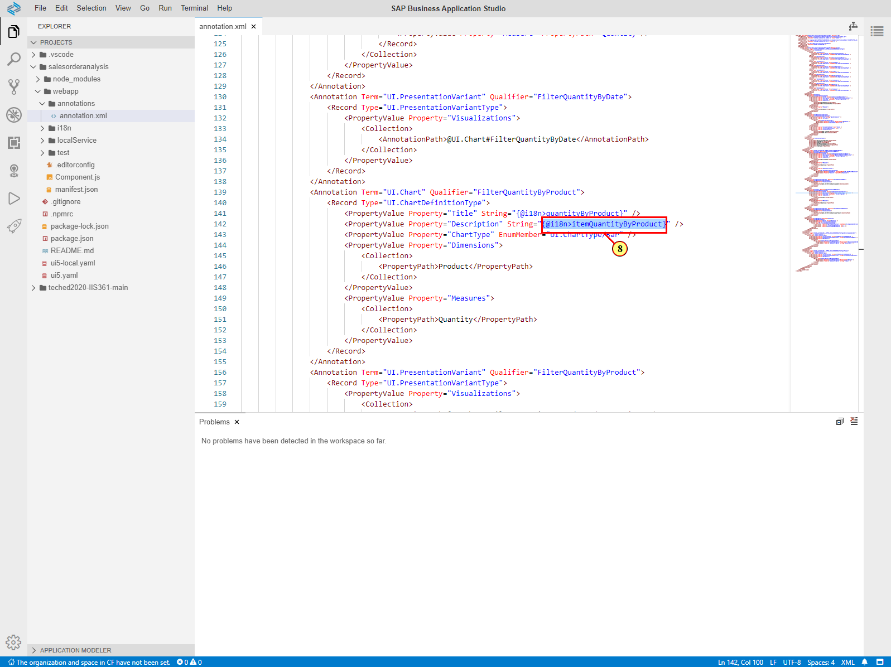
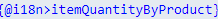
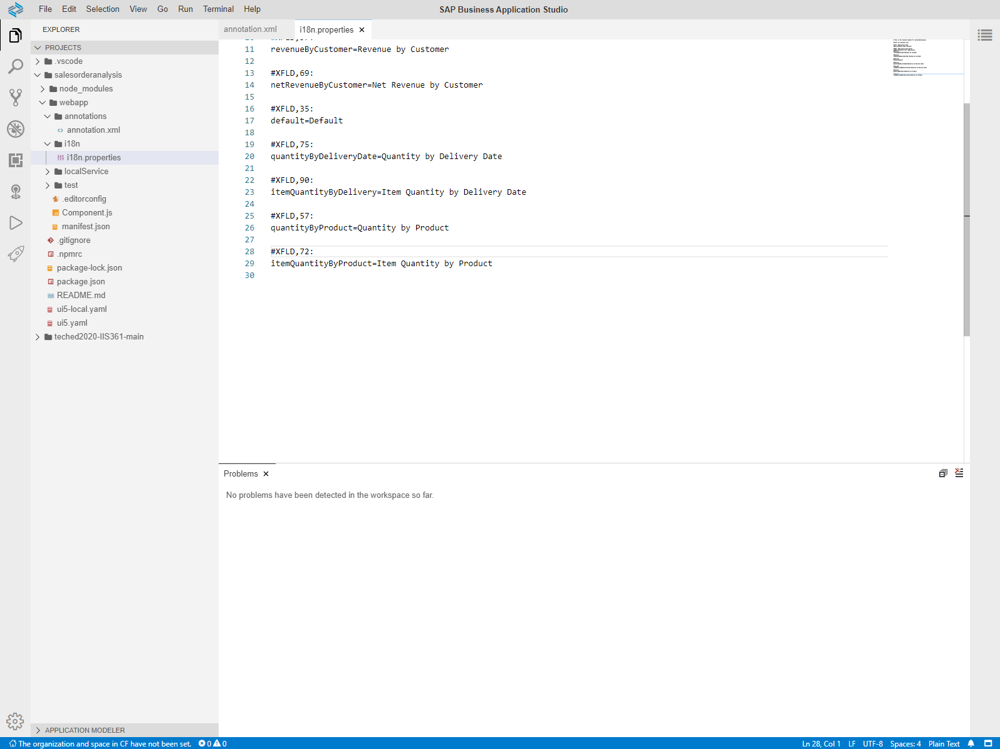
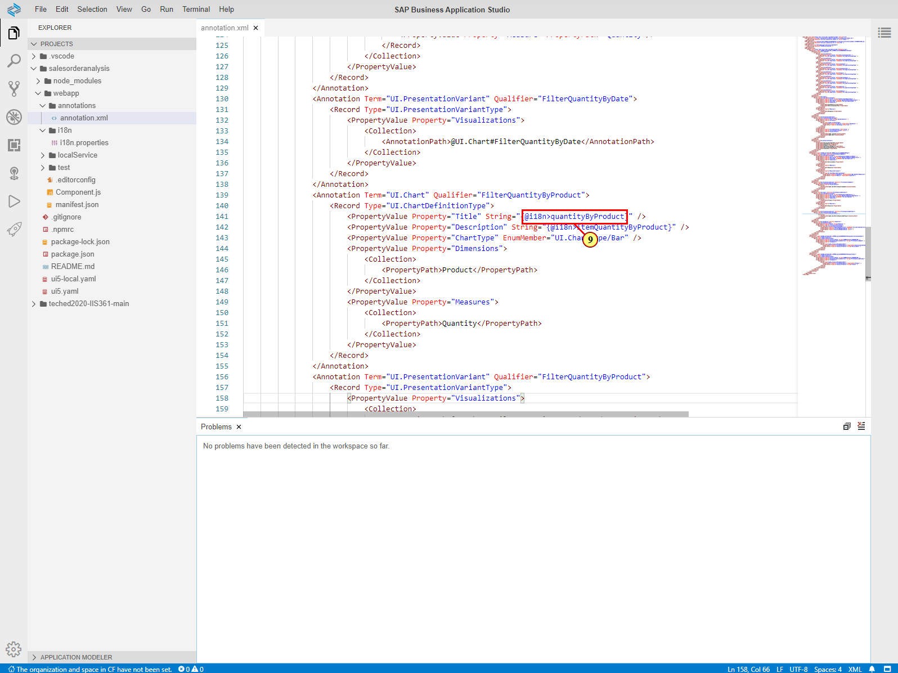
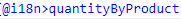
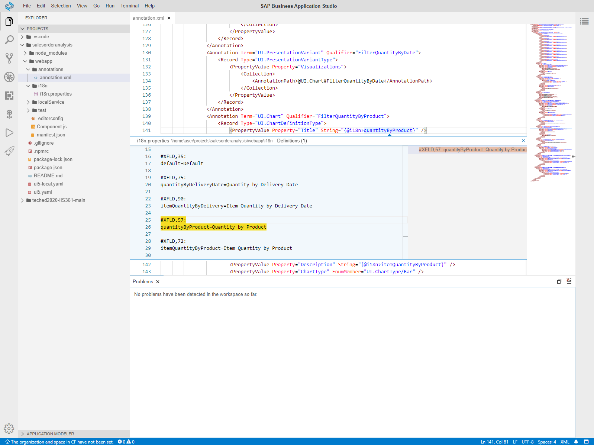

Exercise 4 - Preparing texts for translation
=============================================

In this exercise, you will generate the translation text keys for the hard-coded string values you used in the previous exercises. For this you will use the i18n support of the XMl annotation LSP.

When you work with the annotation file, directly in the code editor or indirectly through the Guided Development tool, its content is validated against the local service metadata, OData vocabularies and i18n properties file of your project. When the text you enter for a language-dependent string, such as chart title or description, annotation LSP shows the warning message indicating that this is a hard coded text and it needs to be substituted with the reference to the translation key in i18n properties file. Such warnings are accompanied with the suggested Quick Fix actions letting you perform several actions with one click:

-   auto-generate the key for the text string

-   store it in i18n properties file

-   substitute the hard coded text string in the annotation file with the reference to the generated text key.

You can then navigate to the translation key and update the value any time.

As an option, you can also use the code completion (CTRL+Space) in the local annotation file to select one of the existing text keys in the string values.

(1) In **Explorer** pane, double-click on **annotation.xml** file to open it.

(2) Open **View** menu.

(3) Choose **Problems**. Problems View opens at the bottom.

(4) Look at the warning messages under **annotation.xml** - all of them
are related to the missing text keys. Click at one of the messsages.

Annotation file is scrolled to the place related to the message you
clicked on.

(5) Click on the **Show Fixes**  icon next to it to
display suggested Quick Fixes.

An action to generate the text key is suggested.

(6) Click on the action to accept it.

The key is generated in the **i18n.properties** file and the hard-coded
string text is substituted with the reference to it.

(7) You can repeat the steps above for all the remaining warning
messages in annotation.xml file.

(8) To view or modify the i18n record in the **i18n.properties** file,
**Ctrl+Click** at the text reference .

You are navigated to the i18n.properties file and your cursor is next to
the entry you chose in the annotation file.

(9) To view or modify the i18n record without leaving the file, click on
the text reference  and press **ALT+F12**.

