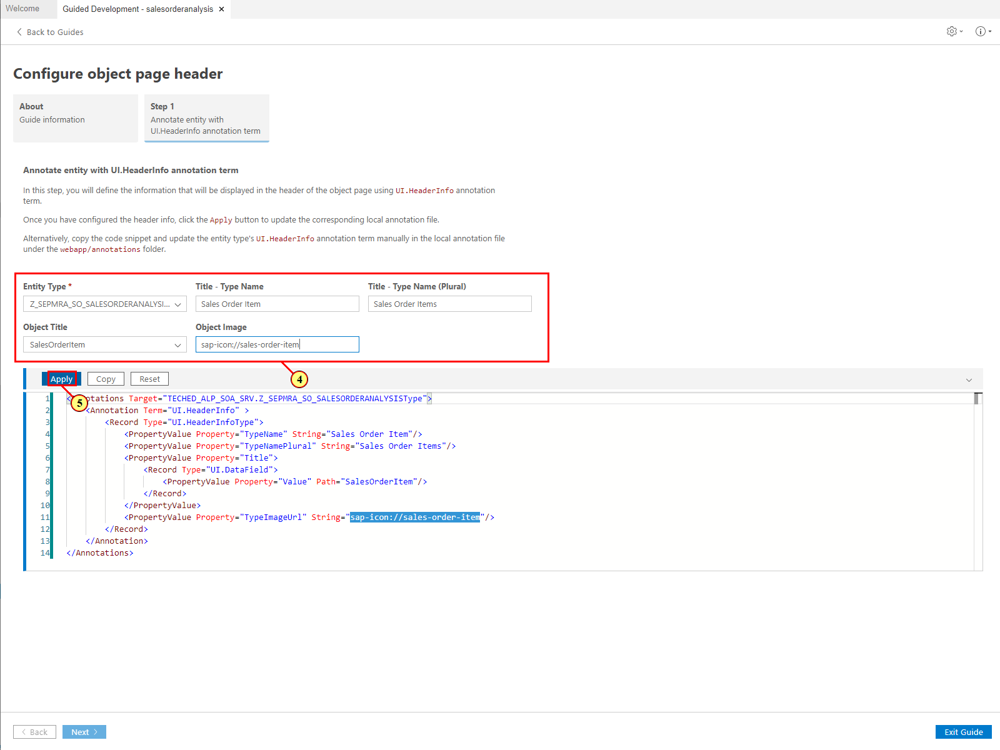

Exercise 5 - Configuring the Second Page (Object Page)
=======================================================

In this exercise, you will define the header and content for the Object
page using the Guided Development tool. Open this tool as in [Exercise 2
-- Configuring Content Area of Analytical List Page](../ex2#exercise-2---configure-content-area-in-analytical-list-page).

Exercise 5.1 Define Header Information
--------------------------------------

In this exercise, you will define the information that will be displayed
in the header of the object page: the ID of the sales order item and an
icon. You will also change the title of the object page (type name) and
set title of the table of the List Report page (type name plural). For
this, you will use the guide **Configure object page header**.

(1) In Guided Development tool, enter **header** into the **Search**
field.

(2) Expand the guide **Configure object page header**
 in the **Object Page** group.

(3) Click **Start Guide**.

(4) Enter the following values:

  |**Field**                     |**Value**
  |----------------------------- |----------------------------------
  |Entity Type                   |SEPMRA_SO_SALESORDERANALYSISType
  |Title -- Type Name            |Sales Order Item
  |Title -- Type Name (Plural)   |Sales Order Items
  |Object Title                  |SalesOrderItem
  |Object Image                  |sap-icon://sales-order-item

(5) Click **Apply**.

The basic header of the object page is defined and you can exit the
guide.

(Optional) Start the application preview as described in the [Exercise 2.4 Starting the Application Preview](../ex2#exercise-24-starting-the-application-preview).

**Note**: To navigate to the Object page in your application preview,
click on the navigation indicator ( '\>' ) at the end of a table row in
the Analytical list page.

Exercise 5.2 Displaying Data Points in Object Page Header
---------------------------------------------------------

In this exercise, you will you will add two additional pieces of
information to the Object page header: the net amount of the sales order
item and its status. For this, you will use the guide **Add a header
facet using data points.**

(6) In Guided Development tool, expand the guide **Add a header facet
using data points**  .

**Note**: You can double-click on the **Guided Development -
salesorderanalysis** tab to get more editing space by temporarily hiding
the **Explorer** pane.

(7) Click **Start Guide**.

(8) In the first step of the guide, enter the following values to define
the first data point:

  |**Field**              |**Value**
  |---------------------- |----------------------------------
  |Entity Type            |SEPMRA_SO_SALESORDERANALYSISType
  |Data Point Qualifier   |NetAmount
  |Property               |NetAmount

(9) Click **Apply**.

(10) Now update the following values to define the second data point:

  |**Field**              |**Value**
  |---------------------- |----------------------------------
  |Entity Type            |SEPMRA_SO_SALESORDERANALYSISType
  |Data Point Qualifier   |Status
  |Property               |SalesOrderStatus

(11) Click **Apply**.

(12) Click **Step 2**. Here you will reference the data points created
in Step 1 in HeaderFacets to display them in the Object page header.

(13) Enter the following values to reference the first data point:

  |**Field**              |**Value**
  |---------------------- |----------------------------------
  |Entity Type            |SEPMRA_SO_SALESORDERANALYSISType
  |Data Point Qualifier   |UI.DataPoint\#NetAmount

(14) Click **Apply**.

(15) Now choose the second data point to reference it in header too.

(16) Click **Apply**.

The header of the object page is now configured and you can exit the
guide.

(Optional) Start the application preview as described in the [Exercise 2.4 Starting the Application Preview](../ex2#exercise-24-starting-the-application-preview).

**Note**: You can notice, that the revenue figure is displayed with a
currency, even though we did not define it. This is due to annotations
already configured for you in the **metadata.xml** file: the **NetAmount** and **Currency** properties are tied together using the `sap:unit` and
`sap:semantics` annotations.

Exercise 5.3 Adding Field Group Sections to the Object Page 
-----------------------------------------------------------

In this exercise, you will define two sections in the ObjectPage
displaying information about the sales order item and its related
product in a form as field groups. For this, you will use the guide
**Add field group as a section to a page**.

(17) In Guided Developmet tool, enter **section** into the **Search**
field.

(18) Expand the guide **Add field group as a section to a
page** in the **Object Page** group.

(19) Click **Start Guide**.

(20) In the first step of the guide, you define the field groups. Enter
the following values to define the first group:

  |**Field**     |**Value**
  |------------- |----------------------------------
  |Entity Type   |SEPMRA_SO_SALESORDERANALYSISType
  |Qualifier     |General

(21) In the **Property** field, choose **Sales Order**. It will be used
as a first field in the group

(22) Click **Apply**.

Repeat steps **(21)** and **(22)** to add the following fields to the first
group:

-   DeliveryCalendarDate

-   GrossAmount

-   NetAmount

(23) Click **Step 2** to reference the newly created group in the
section. This section will then appear in the content area of the Object
page.

(24) Enter the following values to create a section for the first field
group:

  |**Field**     |**Value**
  |------------- |------------------------
  |Label         |General Information
  |ID            |GI
  |Field Group   |UI.FieldGroup\#General

(25) Click **Apply**.

(26) Go back to **Step 1** to create a second field group.

(27) Change the value in the **Qualifier** field to **Product** to
create a group displaying product information.

 

(28) Change the value in the **Property** field to **ProductName** to
add a new field to the second field group.

 

(29) Click **Apply**.

Repeat steps **(28)** and **(29)** to add the following fields to this group:

-   MainProductCategory

-   SupplierCompanyName

-   NetProductPrice

-   Quantity

(30) Click **Step 2** to reference also the second field group in the
section. It will then appear in the content area of the Object page next
to the first one.

(31) Change values as follows to create a section for the second field
group:

  |**Field**     |**Value**
  |------------- |------------------------
  |Label         |Product Information
  |ID            |PI
  |Field Group   |UI.FieldGroup\#Product

(32) Click **Apply**.

The content area of your Object page is now enhanced with two sections,
each displaying a field group.

Exit the guide and start the application preview as described in the
[Exercise 2.4 Starting the Application Preview](../ex2#exercise-24-starting-the-application-preview).

**Note**: To navigate to the Object page in your application preview,
click on the navigation indicator ( '\>' ) at the end of a table row in
the Analytical list page.

Summary
-------

You have successfuly configured the basic content for your Object page.
